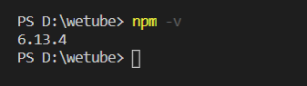
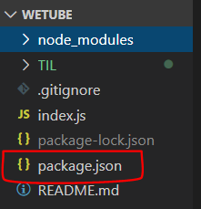
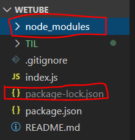

# Express.js

> - 참고: https://ithub.tistory.com/32
> - https://expressjs.com/ko/


### 1. Express.js란 무엇인가?

- Node.js를 위한 빠르고 간편한 웹 프레임워크
- Node.js의 핵심 모듈인 http와 Connect 컴포넌트를 기반으로 하는 웹 프레임워크
- 서버 개발 과정이 대부분 비슷하기 때문에 이런 프레임위크를 사용함


### 2. Installing Express with NPMjs

- NPM: Node Package Manager

  https://www.npmjs.com/

- npm을 설치하지 않았는데 버전 확인이 가능

  **WHY??** `npm`은 `node.js`를 다운받으면 따라오기 때문에 따로 설치할 필요가 없음

   

- npm으로 프로젝트를 시작하려면 npm이 정한 방식으로 프로젝트를 시작해야 함

  > Visual Code Terminal

  ```bash
  npm init
  
  #명령어 친 후에 package name, version, description, author 등을 적어줌
  ```

  그러면 `package.js`가 생성된 것을 확인 가능

   
  - package.json

    ```json
    {
      "name": "wetube",
      "version": "1.0.0",
      "description": "Cloning Youtube with Vanila and NodeJS",
      "main": "index.js",
      "repository": {
        "type": "git",
        "url": "git+https://github.com/JANGHEEEUN/JS_FullStack.git"
      },
      "author": "JANGHEEEUN",
      "license": "ISC",
      "bugs": {
        "url": "https://github.com/JANGHEEEUN/JS_FullStack/issues"
      },
      "homepage": "https://github.com/JANGHEEEUN/JS_FullStack#readme",
    }
    ```

- installing express

  npm 명령을 실행할 때는 package.json이 있는 폴더에서 실행해야 함

  > Visual Code Terminal

  ```bash
  npm install express
  ```

  `package-lock.json`과 `node_modules`가 생성됨 

   

  - package.json에 `dependency` 생성

    **"express": "^4.17.1"** : express 역시 다른 것에 의존하고 있음

    ```json
    {
      "name": "wetube",
      "version": "1.0.0",
      "description": "Cloning Youtube with Vanila and NodeJS",
      "main": "index.js",
      "repository": {
        "type": "git",
        "url": "git+https://github.com/JANGHEEEUN/JS_FullStack.git"
      },
      "author": "JANGHEEEUN",
      "license": "ISC",
      "bugs": {
        "url": "https://github.com/JANGHEEEUN/JS_FullStack/issues"
      },
      "homepage": "https://github.com/JANGHEEEUN/JS_FullStack#readme",
      "dependencies": {
        "express": "^4.17.1"
      }
    }
    ```

    

### 3. package.json의 장점

- 다른 사람과 협업하고 싶은 경우 node_modules 폴더를 다 줘야 할 필요 없음

  코드와 package.json 파일만 주고 난 뒤 `npm install` 만 해주면 자동으로 `dependencies`를 참고해 자동으로 다운해줌