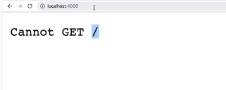

# Express.js

### 1. routing code

- Express의 Routing code를 `index.js`로 copy

  ```json
  const express = require('express');
  const app = express();
  ```

  - require: 다른 node module을 가져오는 것

    node_modules 폴더를 보면 express라는 이름의 폴더가 있음

  - 이 코드에서는 express를 불러와서 `app`을 만듦


### 2. listen()

- index.js 코드를 수정

  ```json
  const express = require('express');
  const app = express();
  
  app.listen(4000);
  ```

- 파일 실행

  > Visual Code Terminal

  ```
  node index.js
  ```

  - http://localhost:4000

     


### 3. node index.js를 더 쉽게

- package.json을 중앙 컨트롤 타워로 만들어줄 것임

  scripts라는 엔트리를 만들어주고 start 명령을 줄 때마다 node index.js를 수행하도록 함

  - package.json

    ```json
    {
      "name": "wetube",
      "version": "1.0.0",
      "description": "Cloning Youtube with Vanila and NodeJS",
      "main": "index.js",
      "repository": {
        "type": "git",
        "url": "git+https://github.com/JANGHEEEUN/JS_FullStack.git"
      },
      "author": "JANGHEEEUN",
      "license": "ISC",
      "bugs": {
        "url": "https://github.com/JANGHEEEUN/JS_FullStack/issues"
      },
      "homepage": "https://github.com/JANGHEEEUN/JS_FullStack#readme",
      "dependencies": {
        "express": "^4.17.1"
      },
      "scripts":{
        "start":"node index.js"
      }
    }
    
    ```

- 다시 실행해보기

  > Visual Code Terminal

  ```bash
  npm start
  ```

  

#### 4. Listening 검사

- index.js 변경

  ```js
  const express = require('express');
  const app = express();
  
  const PORT = 4000;
  
  function handleListening(){
      console.log(`Listening on: http://localhost:${PORT}`);
  }
  
  app.listen(PORT, handleListening);
  ```

  