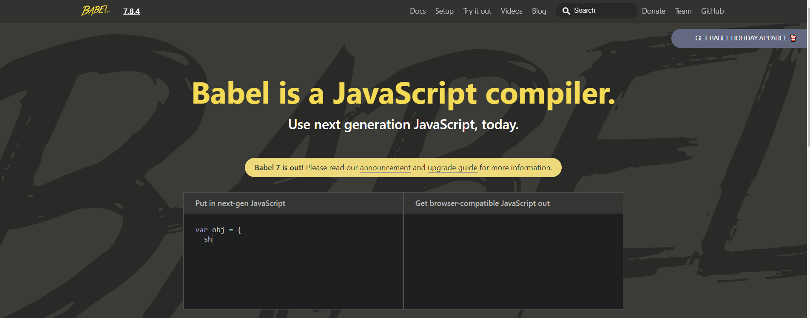
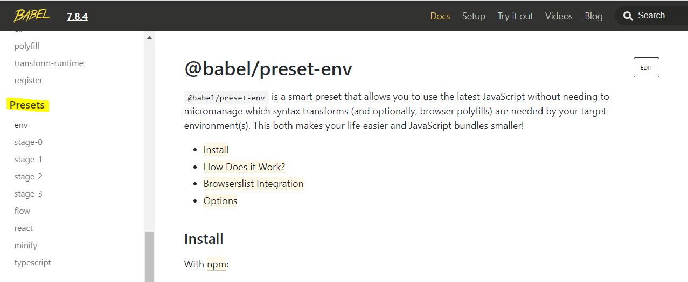

# ES6 on NodeJS using Babel

> 참고
>
> - 


### 1. Babel

https://babeljs.io/

- 최신의 Javascript 코드를 아주 무난한 예전의 Javascript 코드로 변환해줌

   

- babel node install 

  node.js에서 사용할 것이기 때문에 babel의 다양한 용도 중 babel node 설치

  > Visual Code Terminal

  ```bash
  npm install @babel/node
  ```

- babel stage

  babel은 많은 stage를 갖고 있음

  우리가 사용할 것은 env - 최신의 것이지만 실험적이지는 않은 정도

  

  > Visual Code Terminal

  ```bash
  npm install @babel/preset-env
  ```

- `.babelrc`

  이 파일에 우리가 원하는 모든 설정을 다 집어 넣을 것임

  파일을 만들고 아래와 같이 작성

  ```json
  {
      "presets":["@babel/preset-env"]
  }
  ```

- `idnex.js`를 최신의 문법으로

  ```js
  //const express = require('express');
  //const app = express();
  import express from "express";
  ```

- install babel core

  > Visual Code Terminal

  ```bash
  npm install @babel/core
  ```

- `package.json`

  babel이 코드를 변환하고 그 다음 node.js로 실행하도록 코드 변경

  ```json
  //  "scripts": {
  //    "start": "node index.js"
  //  },
    
      "scripts": {
      "start": "babel-node index.js"
    },
  ```

  

### 2. ES6 const 변수 선언

- 이전의 index. js의 `handleProfile function`

  ```js
function handleProfile(req, res){
      res.send("You are on my profile");
}
  ```

- ES6의 새로운 const 변수 선언을 사용한 index.js의 `handleProfile function`

  ```js
  const handleProfile = (req, res) => res.send("You are on my profile");
  ```

  - `=>`: arrow function


### 3. Install nodemon

이전에는 코드에 변경사항이 있으면 서버를 죽이고 다시 시작했음

이 과정 없이 새로고침만으로 수정 사항을 적용할 수 있도록 할 것임

- +) dependency와 별개로 패키지 설치하는 법

  프로젝트와 관련된 패키지를 설치하는 것이 아니라 개발자에게 도움을 주는 패키지를 설치하는 것이므로 dependency와 별개로 설치해야 함

  > Visual Code Terminal

  ```bash
  npm install nodemon -D
  ```

- 설치후 package.json을 확인해보면 새로운 entrypoint `devDependencies`가 생긴 것을 확인 가능

  프로젝트가 아닌 개발자가 필요한 것임을 의미

  ```json
    "devDependencies": {
      "nodemon": "^2.0.2"
    }
  ```

- package.json의 script 변경

  ```json
    "scripts": {
      "start": "nodemon --exec babel-node index.js --delay 2"
    },
  ```