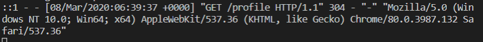
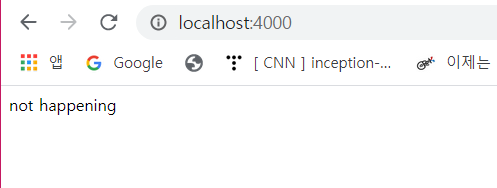
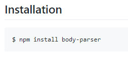

# Express Core: Middlewares part Two

### 1. morgan

https://www.npmjs.com/package/morgan

- logging에 도움을 주는 middleware

  `logging`: 무슨 일이 어디서 일어났는지를 기록

  > Visual Code Terminal

  ```bash
  npm install morgan
  ```

- index.js에 `morgan` import

  ```js
  import morgan from "morgan";
  ```

- index.js에서 middleware 수정

  <수정 전>

  ```js
  const betweenHome = (req, res, next) => {
      console.log("Between");
      next();
  };
  
  app.use(betweenHome);
  ```

  <수정 후>

  ```js
  app.use(morgan("tiny"));
  ```

  사이트 접속 시 로깅 기능을 갖게 됨

   

- `combined`

  ```js
  app.use(morgan("combined"));
  ```

  

- `dev`

  ```js
  app.use(morgan("dev"));
  ```

   


### 2. helmet

https://github.com/helmetjs/helmet

node.js 앱의 보안에 도움이 되는 것 

- Install helmet

  > Visual Code Terminal

  ```bash
  npm install helmet	
  ```

- index.js에서 helmet import

  ```js
  import helmet from "helmet";
  
  app.use(helmet());
  ```

- +) 가끔은`middleware`가 **연결을 끊을 수 있다**. (원한다면 middleware로 연결을 끊을 수 있음)

  아래 코드와 같이 middleware가 route 전에 response를 보낸다면 연결이 끊길 것임

  ```js
  import helmet from "helmet";
  
  app.use(helmet());
  
  const middleware = (req, res, next) => {
      res.send('not happening');
  }
  
  app.get("/", middleware, handleHome);
  ```

  

   


### 3. cookie parser

https://github.com/expressjs/body-parser

express의 middleware로 cookie 다루는 것을 도와줌

- install

  > Visual Code Terminal

  ```bash
  npm install cookie-parser	
  ```

- index.js에 import

  ```js
  import cookieParser from "cookie-parser";
  
  app.use(cookieParser());
  ```

  

### 4. body parser

https://github.com/expressjs/body-parser

express의 middleware로 body 다루는 것을 도와줌

- Install

   

- index.js에 import

  ```js
  import bodyParser from "body-parser";
  
  app.use(bodyParser());
  ```

- body parser의 옵션 `json`, `text`, `urlencoded` 등을 이해해야 함

  서버가 우리가 무엇을 전송하는지 알도록 하기 위함

   

  ```js
  app.use(bodyParser.json());
  ```

   

   

  ```js
  app.use(bodyParser.urlencoded());
  ```

  

### +) index.js

```js
import express from "express";
import morgan from "morgan";
import helmet from "helmet";
import cookieParser from "cookie-parser";
import bodyParser from "body-parser";

const app = express();

const PORT = 4000;

const handleListening = () => console.log(`Listening on: http://localhost:${PORT}`);

const handleHome = (req, res) => res.send('Hello from my ass');

const handleProfile = (req, res) => res.send("You are on my profile");

app.use(cookieParser());
app.use(bodyParser.json());
app.use(bodyParser.urlencoded({extended: true}));
app.use(helmet());
app.use(morgan("dev"));

app.get("/", handleHome);

app.get("/profile", handleProfile);

app.listen(PORT, handleListening);
```