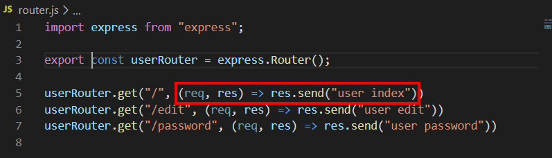

# MVC pattern part one

### 1. Model, View, Control

- **M**odel = data

- **V**iew = how does the data look
- **C**ontroller = function that looks for the data


- router.js

  이 코드에서는 뒷 부분 function이 controller에 해당

  


### 2. Create routers folder

- app.js 변경

  ```js
  import express from "express";
  import morgan from "morgan";
  import helmet from "helmet";
  import cookieParser from "cookie-parser";
  import bodyParser from "body-parser";
  
  const app = express();
  
  app.use(cookieParser());
  app.use(bodyParser.json());
  app.use(bodyParser.urlencoded({extended: true}));
  app.use(helmet());
  app.use(morgan("dev"));
  
  app.use("/user", userRouter);
  
  export default app;
  ```

- rename router.js to userRouter.js

  router.js 이름을 userRouter.js로 바꾸기

  우리는 하나의 라우터가 아니라 여러 개의 라우터를 쓸 것이기 때문

  ```js
  import express from "express";
  
  const userRouter = express.Router();
  
  export default userRouter;
  ```

- create videoRouter.js 

  ```js
  import express from "express";
  
  const videoRouter = express.Router();
  
  export default videoRouter;
  ```

- create routers folder

  폴더에 userRouter.js와 videoRouter.js 넣기

- **+) export **

  위에서처럼 마지막에 default로 export하면 코드 전체를 export

  아래와 같이 변수 앞에서 export를 하면 그 변수만 export

  *llalal 변수는 export 되지 않음*

  ```js
  import express from "express";
  
  export const videoRouter = express.Router();
  
  const llalal 
  ```

- app.js에 코드 추가

  ```js
  import userRouter from "./routers/userRouter";
  import videoRouter from "./routers/videoRouter";
  
  ...
  // app.use("/user", userRouter); 삭제하기
  app.use("/user", userRouter);
  app.use("/video", videoRouter);
  ```

  

### 3. Global Router

`/join`, `/login`, `/home`처럼 userRoter나 videoRouter를 거치지 않는 전역 Router를 만들어 줘야 함

- create routers/globalRouter.js

  ```js
  import express from "express";
  
  const globalRouter = express.Router();
  
  export default globalRouter;
  ```

- app.js에 코드 추가

  ```js
  import globalRouter from "./routers/globalRouter";
  
  ...
  app.use("/", globalRouter);
  ```