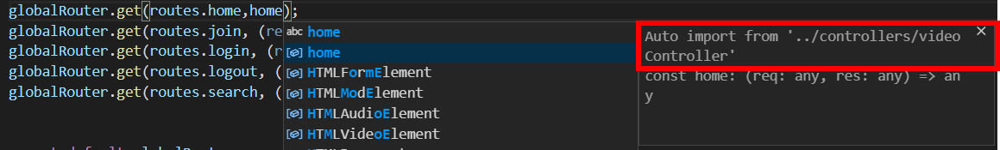

# MVC pattern part three

### 1. Controller

보통 프로젝트에 있는 각 모델마다 controller를 만듦

wetube에서는 `video`, `users`를 만들 것임

- controllers 폴더를 만들고, 안에 userController.js와 videoController.js 만들기

- globalRouter.js에서의 controller 역할을 userController.js와 videoController.js에 작성

  - routers/globalRouter.js

    ```js
    globalRouter.get(routes.home, (req,res) => res.send('Home'));
    globalRouter.get(routes.join, (req,res) => res.send('Join'));
    globalRouter.get(routes.login, (req,res) => res.send('Login'));
    globalRouter.get(routes.logout, (req,res) => res.send('Logout'));
    globalRouter.get(routes.search, (req,res) => res.send('Search'));
    ```

  - controllers/userController.js

    ```js
    export const join = (req, res) => res.send("Join")
    export const login = (req, res) => res.send("Login")
    export const logout = (req, res) => res.send("Logout")
    ```

  - controllers/videoController.js

    ```js
    export const home = (req, res) => res.send("Home");
    export const search = (req, res) => res.send("Search");
    ```

- userController.js와 videoCotroller.js에서 export한 함수들을 globalRouter.js에 import해서 사용

  목록을 따라 방향키로 내려가면 auto import menu를 찾을 수 있음-> 알아서 import를 적용해줌

  

  - globalRouter.js

    ```js
    import express from "express";
    import routes from "../routes";
    
    //auto import
    import { search, home } from "../controllers/videoController";
    import { login, join, logout } from "../controllers/userController";
    
    const globalRouter = express.Router();
    globalRouter.get(routes.home, home);
    globalRouter.get(routes.join, join);
    globalRouter.get(routes.login, login);
    globalRouter.get(routes.logout, logout);
    globalRouter.get(routes.search, search);
    
    
    export default globalRouter;
    ```

- 잘 작동하는 것 확인 가능

   

  

### 2. Arrow function

- 함수를 function으로 정의했을 때 무언가 반환하고 싶다면 return을 적어줘야 함

  ```js
  function a(){
  return true
  }
  ```

- **arrow function**에는 implicit return(암시적 리턴)이 존재

  `{}`를 적어주면 암시적 성격을 잃어서 위처럼 `return`을 적어주어야 함

  ```js
  a = () => true
  
  //암시적 성격을 잃은 arrow function
  a = () => {
  return true
  }
  ```

  

