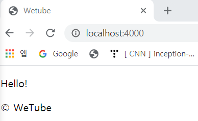

# Layouts with Pug

### 1. Using Pug

- HTML과 CSS만으로 작업할 때는 똑같은 것을 반복하는 경우가 많기 때문에 별로 좋지 않음

  HTML과 CSS는 프로그래밍 언어가 아니고 논리적인 작업을 할 수 없음

- pug를 사용하면 html을 생성하는 javascript의 위력을 사용할 수 있음

- `views/layouts/main.pug` 생성

  모든 페이지들의 토대가 되는 파일

  `tab`안의 코드는 children 코드

  - main 태그에 다른 모든 페이지들의 내용이 들어갈 것임

    이를 위해 `block` 사용 - block은 name이 필요하므로 `content`로 이름 설정

  ```pu
  doctype html
  html
      head
          title Wetube
      body
          main
              block content
          footer
              span &copy; WeTube
  ```

  

###  2. Using Layout

- views/home.pug에서 `extension` 사용

  main.pug 레이아웃을 템플릿에서 확장하겠다는 의미

  main.pug 코드들도 사용하고 거기에 추가적인 것을 더하겠다는 뜻 - home 화면이 main을 copy paste

  ```
  extends layouts/main
  ```

- main.pug에서 block content가 들어가는자리에 내용 채워넣기

  ```
  block content
      p Hello!
  ```

   

- main.pug에 header 추가

  ```
  doctype html
  html
      head
          title Wetube
      body
          header
              h1 WeTube
          main
              block content
          footer
              span &copy; WeTube
  ```

- 모든 템플릿에 main을 extends

