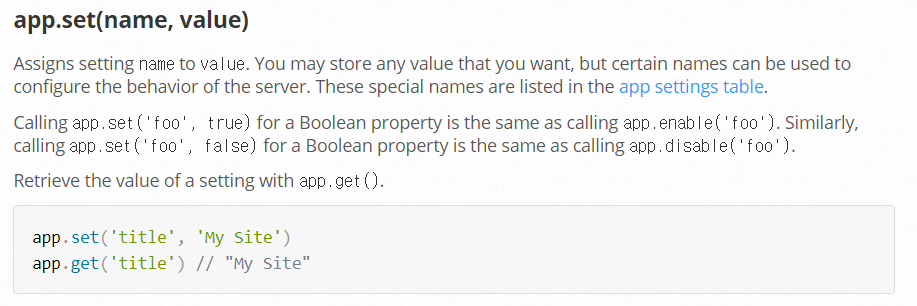
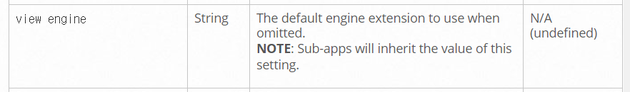
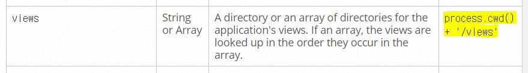
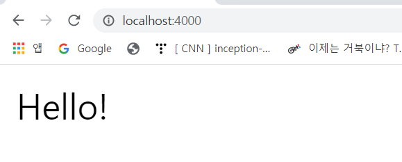

# Layouts with Pug

### 1. Installing Pug

- pug

  **Node Express Template Engine**
  
- pug의 장점

  1. HTML을 간단하게 표현해서 가독성이 좋음
  2. 마크업 문법보다 코드량이 적어 생산성이 좋아짐
  3. JS 연산 결과를 쉽게 보여줄 수 있음
  4. 정적인 부분과 동적인 부분을 따로 할 수 있음
  5. 다른 Express Engine보다 Google Trend 수치가 높음
  
- Installing pug

  > Terminal

  ```bash
  npm install pug
  ```

- settings

  https://expressjs.com/en/4x/api.html#app.set

  

  우리는 `view engine` 설정을 변경할 것임 - default: `undefined`

  

  - app.js에 설정 추가

    ```js
    app.set('view engine', "pug");
    ```

- views

  pug와 express에는 view 파일들의 위치에 관한 기본 설정이 있음

  만약 설정을 바꾸고 싶다면 `views` 설정을 변경하면 됨 - default: `'views'`

  

  

### 2. Using pug

- views/home.pug 생성

  html 대신 확장자 **pug**

- example Hello

  ```pug
  // HTML
  // <p> Hello </p>
  
  // pug
  p Hello
  ```

- res.send로 전송하는 것 대신 pug 템플릿을 웹사이트에 전송

  `res.render`을 사용

  - videoController.js

    render 함수가 views 폴더에서 파일명이 `home`이고 확장자가 `pug`인 파일을 찾은 후에 보여줄 것임

    위에서 app.js에 `view engine`을 설정했기 때문에 확장자 `pug`를 찾을 수 있음

    ```js
    export const home = (req, res) => res.render("home");
    ```

     