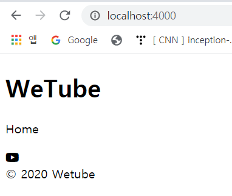
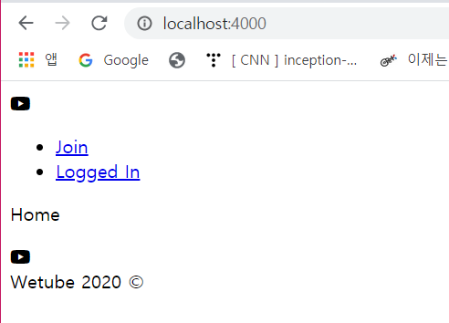

# Partials with Pug

### 1. Partials_footer

- 페이지의 일부분

- layouts/main.pug

  fontawesome에서 아이콘을 추가

  ```
  doctype html
  html
      head
          link(rel="stylesheet", href="https://use.fontawesome.com/releases/v5.5.0/css/all.css" integrity="sha384-B4dIYHKNBt8Bc12p+WXckhzcICo0wtJAoU8YZTY5qE0Id1GSseTk6S+L3BlXeVIU", crossorigin="anonymous")
          title Wetube
      body
          header
              h1 WeTube
          main
              block content
          footer
              span &copy; WeTube
  ```

- partials/footer.pug

  유투브 아이콘이 들어갈 것임 

  https://fontawesome.com/icons/youtube?style=brands

  footer 태그에 footer이라는 클래스를 추가하고 div에는 footer__icon이라는 클래스를 추가

  icon 다음에 span 태그 추가 - span 태그의 class 명은 `footer__text`

  이 span 태그에 연도와 Wetube를 추가 -> **연도가 자동으로 바뀌도록 변경할 예정 with JS**  

  ```
  //copy한 코드
  //footer
  //    div<i class="fab fa-youtube"></i>
  
  footer.footer
      .footer__icon
          i.fab.fa-youtube
      span.footer__text &copy; 2020 Wetube
  ```

- layouts/main.pug 수정

  footer 태그를 지우고 아래 코드 삽입

  ```
  include ../partials/footer
  ```

   

- 위의 과정이 컴포넌트를 분리하는 방식 (조직적인 방식)

  footer와 header를 분리함으로써 조직화

  프로그래밍은 **분할 정복**


###  +) Year Update with JS

- #{} 안에 코딩

  ```
  //span.footer__text &copy; 2020 Wetube
  span.footer__text &copy; #{new Date().getFullYear()} Wetube
  //Wetube 2020 copyright 순으로 단순 변경
  span.footer__text Wetube #{new Date().getFullYear()} &copy; 
  ```


### 1. Partials_header

- partials/header.pug

  header 태그에 header이라는 클래스 이름을 설정

  2개의 col을 만든 뒤 하나의 col에는 아이콘을 다른 하나의 col에는 Join과 Login을 넣을 것임

  (로그인을 하지 않았다면 사용자에게 권한은 조인/로그인 두 개 뿐이기 때문)

  ```
  header.header
      .header__column
          i.fab.fa-youtube
      .header__column
          ul 
              li
                  a(href="#") Join
              li
                  a(href="#") Login
  ```

- layouts/main.pug

  header.pug의 partial을 main.pug에 추가

  ```
  doctype html
  html
      head
          link(rel="stylesheet", href="https://use.fontawesome.com/releases/v5.5.0/css/all.css" integrity="sha384-B4dIYHKNBt8Bc12p+WXckhzcICo0wtJAoU8YZTY5qE0Id1GSseTk6S+L3BlXeVIU", crossorigin="anonymous")
          title Wetube
      body
          include ../partials/header
          main
              block content
          include ../partials/footer
  ```

   

- routes.js의 라우트에 접근 가능하도록 할 예정

  header.pug의 `a(href="#") Join`에서 href 태그에 하나하나 경로를 적는 것은 비효율적이기 때문

  만약 라우트 주소가 바뀐다면 pug도 바꿔주어야 함

  **One Single Source of Truth - 한 곳에서만 정보를 보관한다**

  경로와 같이 많은 곳에 영향을 주는 경우, 한 곳에서만 정보를 보관하면 하나만 변경해도 다른 것들이 자동으로 변경되기 때문에 버그 최소화 가능

- block

  main.pug의 main 태그 밑에 block을 적지 않는다면 어떠한 템플릿도 작동하지 않음

  block을 추가해야 페이지의 내용들이 채워짐

  main,pug에 block이라는 창문을 추가하고 나중에 editVideo.pug와 같은 곳에서 내용물을 보는 것과 같다.

