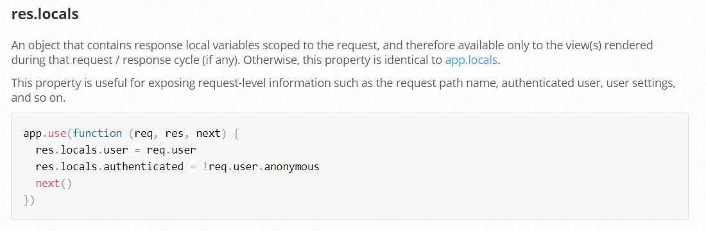
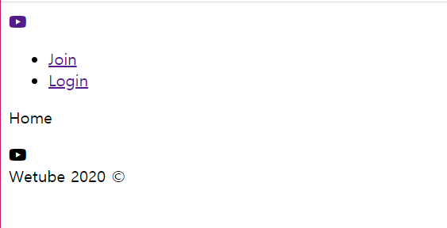

# Local Variables in Pug

### 1. Adding Information on  All Templates

- header.pug가 Route.js에 접근하도록 설정

  그러기 위해서는 **미들웨어**를 사용해야 함 - `미들웨어`: 레이어 같은 것, 위에서 밑으로 한 단계씩 내려감

  - app.js Middleware

    처음에 view engine을 pug로 설정

    cookie를 파싱하고, body에 담긴 정보를 파싱

    그 다음 helmet과 morgan이 있음 ==> helmet 맨 위로 변경

    그 후에 controller와 routes 들이 있음

    ```js
    app.use(helmet());
    app.set('view engine', "pug");
    app.use(cookieParser());
    app.use(bodyParser.json());
    app.use(bodyParser.urlencoded({extended: true}));
    app.use(morgan("dev"));
    
    app.use(routes.home, globalRouter);
    app.use(routes.users, userRouter);
    app.use(routes.videos, videoRouter);
    ```

- `locals`라는 미들웨어를 만들어 볼 것임

  local 변수를 global 변수로 사용하도록 만들어주는 것

  local 기능을 통해 변수에 접근 가능

  - app.js에 `localMiddleware` 추가

    3가지 방법 중 가장 좋은 방법인 3번째 사용

    변수 설정을 app.js에 넣지 않고 새로운 파일에 넣어 export 할 예정

    ```js
    // 방법 1
    app.use((req, res, next) => {
        
    })
    
    // 방법 2
    app.use(function(req,res,next){
        
    })
    
    //방법 3
    const localsMiddleware = (req, res, next) => {
        
    }
    
    app.use(localsMiddleware)
    ```

- app.js에서 middleware의 위치

  만약 middleware를 아래서 2번째 라인인 `videoRouter` 위에 넣는다면, 그위에 있는 `globalRouter`, `userRouter`에서는 locals에 접근을 못 함

  **위치가 매우 중요!!**

  ```js
  app.use(helmet());
  app.set('view engine', "pug");
  app.use(cookieParser());
  app.use(bodyParser.json());
  app.use(bodyParser.urlencoded({extended: true}));
  app.use(morgan("dev"));
  
  app.use(localsMiddleware);
  
  app.use(routes.home, globalRouter);
  app.use(routes.users, userRouter);
  app.use(routes.videos, videoRouter);
  ```

- middlewares.js 파일 만들기

  이 파일에 locals를 추가 - local 변수를 템플릿, 컨트롤러 등 아무곳에서나 사용 가능

  https://expressjs.com/en/4x/api.html#res

  

  - siteName

    middlewares.js의 변수로 siteName을 할당

    ```js
    export const localsMiddleware = (req, res, next) => {
        res.locals.siteName = "Wetube";
    }
    ```

    어디까지 사용할 수 있을까???

    -> main.pug에서 title Wetube라고 사용한 것 대신 #{} 안에 siteName 변수를 넣어 사용가능

    ```
    // title Wetube
    title #{siteName}
    ```

  - routes

    routes 변수에 routes.js 객체를 추가 - routes 파일 import

    ```js
    import routes from "./routes";
    
    export const localsMiddleware = (req, res, next) => {
        res.locals.siteName = "Wetube";
        res.locals.routes = routes;
    }
    ```

    이제 partials/header.pug에서 다음과 같이 사용 가능

    ```
    // a(href="") Join
    a(href=route.join) Join
    a(href=route.login)Login
    ```

  - middleware.js에서 middleware가 next에 req을 전달해주어야 함

    next() 추가

    ```js
    import routes from "./routes";
    
    export const localsMiddleware = (req, res, next) => {
        res.locals.siteName = "Wetube";
        res.locals.routes = routes;
        next();
    }
    ```

- app.js에서 app.use()에 `localsMiddleware` 임포트

  +) 알파벳 순으로 임포트 하도록 하는 것이 좋은 습관임

  ```js
  import { localsMiddleware } from "./middlewares";
  
  ...
  app.use(localsMiddleware);
  ```

- header.pug 수정

  아이콘 위에 a 태그로 경로를 주어 아이콘을 누르면 Home으로 이동하도록 함

  ```
  header.header
      .header__column
          a(href=routes.home)
              i.fab.fa-youtube
      .header__column
          ul 
              li
                  a(href=routes.join) Join
              li
                  a(href=routes.login) Login
  ```

   

- 이제 템플릿을 직접 수정하지 않고 middlewares.js에서 수정하면 됨