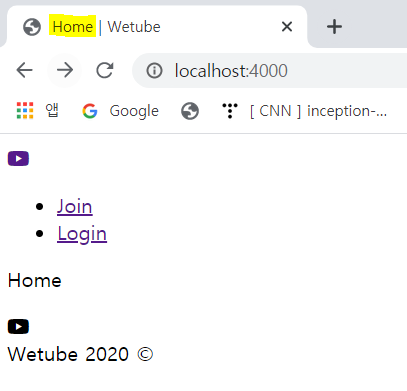

# Template Variables in Pug

### 1. How to Add Variables to Only One Template

템플릿마다 다른 정보를 가질 수도 있으므로 한 템플릿에만 변수를 설정해야 하는 경우도 있음

어떤 템플릿에는 비디오, 다음 템플릿은 사용자 이런 식으로 다를 수 있기 때문

- main.pug에 `pageTitle` 변수 추가

  ```
  title #{pageTitle} | #{siteName}
  ```

  저장하고 새로고침해보면, `pageTitle`이 정의되지 않아 보이지 않음

- videoController에서 한 화면에만 변수를 추가

  render 함수의 첫 번째 인자는 템플릿이고 두 번째 인자는 템플릿에 추가할 정보가 담긴 객체임

  home에 pateTitle 변수를 추가하고 값으로 "Home"을 줌

  ```
  export const home = (req, res) => res.render("home", {pageTitle : "Home"});
  ```

   


### 2. Changing Controllers

- videoController.js

  ```js
  export const home = (req, res) => res.render("home", { pageTitle : "Home" });
  export const search = (req, res) => res.render("search", { pageTitle : "Search" });
  export const videos = (req, res) => res.render("videos", { pageTitle : "Videos" });
  export const upload = (req, res) => res.render("upload", { pageTitle : "Upload" });
  export const videoDetail = (req, res) => res.render("videoDetail", { pageTitle : "VideoDetail" });
  export const editVideo = (req, res) => res.render("editVideo", { pageTitle : "EditVideo" });
  export const deleteVideo = (req, res) => res.render("deleteVideo", { pageTitle : "DeleteVideo" });
  ```

- userController.js

  ```js
  export const join = (req, res) => res.render("join", { pageTitle : "Join" });
  export const login = (req, res) => res.render("login", { pageTitle : "Login" });
  export const logout = (req, res) => res.render("logout", { pageTitle : "Logout" });
  export const users = (req, res) => res.render("users", { pageTitle : "Users" });
  export const editProfile = (req, res) => res.render("editProfile", { pageTitle : "Edit Profile" });
  export const changePassword = (req, res) => res.render("changePassword", { pageTitle : "Change Password" });
  export const userDetail = (req, res) => res.render("userDetail", { pageTitle : "User Detail" });
  ```