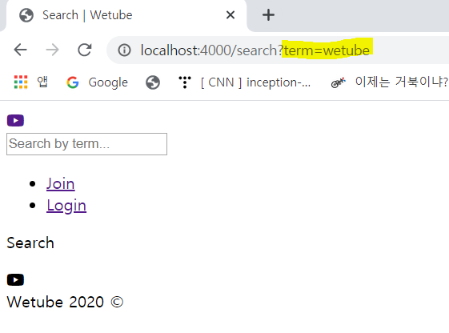
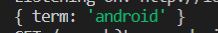
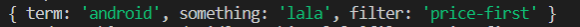
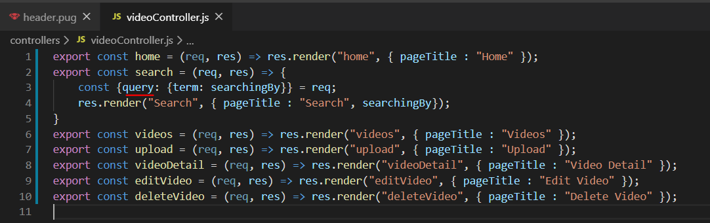
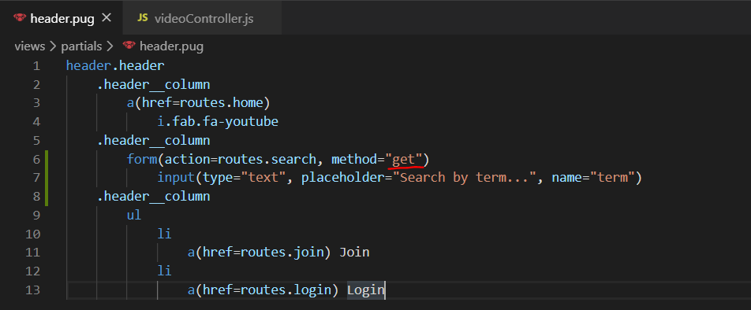

# Search Controller

### 1. Search

- partials/header.pug 수정

  칼럼 추가

  ```
  header.header
      .header__column
          a(href=routes.home)
              i.fab.fa-youtube
      .header__column
          form(action=routes.search, method="get")
              input(type="text", placeholder="Search by term...")
      .header__column
          ul 
              li
                  a(href=routes.join) Join
              li
                  a(href=routes.login) Login
  ```

  검색창에 검색을 하면 `Search` 페이지로 이동하며, url에 search 뒤에 `?`가 붙는 것을 확인할 수 있음

  input에 name을 추가하지 않아서 ?가 붙는 것

   

- input 태그에 name 설정

  ```
  input(type="text", placeholder="Search by term...", name="term")
  ```

   

- search.pug 수정

  위에서 Search 자리에 **Searching by ~~**식으로 표현하기 위함

  아직은 작동하지 않음 -> 컨트롤러 수정 필요

  ```
  extends layouts/main
  
  block content
      .search__header
          h3 Searching by #{searchingBy}
  ```

  

  ### 2. videoController.js

  이제는 암시적 리턴을 사용할 수 없음

  아래와 같이 코드 변경 후 검색창에 `android`를 입력하면 terminal 창에서 req을 볼 수 있음

  ```js
  // export const search = (req, res) => res.render("search", { pageTitle : "Search" });
  export const search = (req, res) => {
      console.log(req.query);
  }
  ```

   

  - **query**

    url에 http://localhost:4000/search?term=android&something=lala&filter=price-first와 같이 &로 많은 쿼리를 넣을 수 있음

     

- ES6 이전의 방식으로 searchingBy 변수 선언

  ```js
  const searchingBy = console.log(req.query.term);
  ```

- 최신의 방식으로 searchingBy 변수 선언

  ```js
  const {query: {term}} = req;
  ```

  - term에 이름을 할당할 수 있음

    ```js
    const {query: {term: searchingBy}} = req;
    ```

- final `const search`

  searchingBy를 search 템플릿에 전송하기 위해 searchingBy를 뒤에 추가

  ```js
  export const search = (req, res) => {
      const {query: {term: searchingBy}} = req;
      res.render("Search", { pageTitle : "Search", searchingBy});
  }
  ```

   


### +) GET

- 컨트롤러가 query에 접근하려면 method가 get이어야 함

  

  

  post라면 주소에 검색한 내용(term)이 표시되지 않음