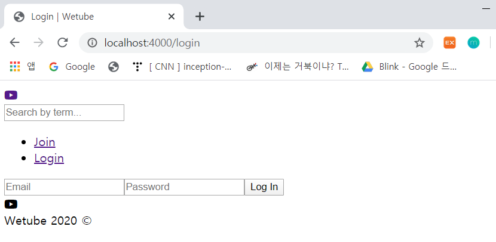
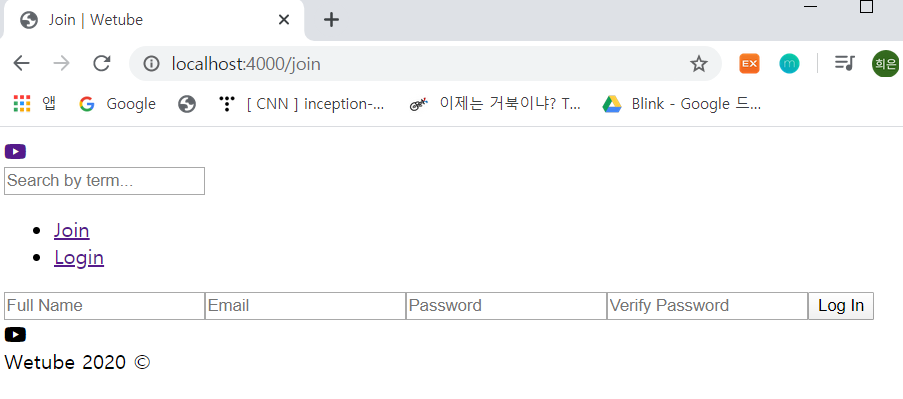
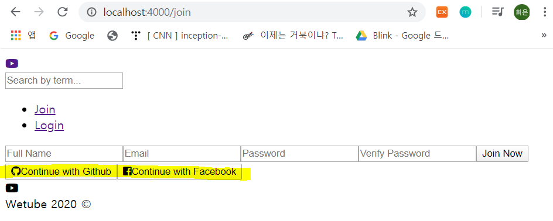

# Join: Log In HTML

### 1. Home

- Home 화면[home.pug]에 .videos를 추가하고 h1 태그에 video 텍스트 추가

  ```
  extends layouts/main
  
  block content
      .videos
          h1 Video
  ```

  

### 2. Login

- login.pug

  form 태그의 method는 무조건 **POST**

  ```
  extends layouts/main
  
  block content
      .form__container
          form(action="/login", method="post")
              input(type="email", name="email", placeholder="Email")
              input(type="password", name="password", placeholder="Password")
              input(type="submit", value="Log In")
  ```

  

  

### 3. Join

- join.pug

  ```
  extends layouts/main
  
  block content
      .form__container
          form(action="/login", method="post")
              input(type="text", name="name", placeholder="Full Name")
              input(type="email", name="email", placeholder="Email")
              input(type="password", name="password", placeholder="Password")
              input(type="password", name="password2", placeholder="Verify Password")
              input(type="submit", value="Join Now")
  ```

  


### 4. Partial

- button을 원하는 만큼 만들기 위해 partials를 만듦

  버튼 하나는 깃헙 계정으로 로그인, 다른 하나는 페북 계정으로 로그인하기 위한 것

  이 두 버튼을 Join과 Login 화면에 띄우고 싶음

  즉, 원하는 만큼 소셜 로그인 기능을 Join 화면과 Login 화면 모두에 띄우기 위함

- partials/socialLogin.pug 생성

  github icon: https://fontawesome.com/icons/github?style=brands

  facebook icon: https://fontawesome.com/icons/facebook-square?style=brands

  ```
  .social-login
      button.social-login--github
          span
              i.fab.fa-github
          |Continue with Github
      button.social-Login--facebook
          span
              i.fab.fa-facebook-square
          |Continue with Facebook      
  ```

  - Continue with Github 앞에 `|` 를 붙여준 이유

    이렇게 하지 않으면 앞에 element가 없어 error - continue를 텍스트가 아닌 태그로 취급

    텍스트 앞에  `|`를 붙여줘 해결

- `social-login`을 join.pug의 form container에 추가

  ```
  extends layouts/main
  
  block content
      .form__container
          form(action="/login", method="post")
              input(type="text", name="name", placeholder="Full Name")
              input(type="email", name="email", placeholder="Email")
              input(type="password", name="password", placeholder="Password")
              input(type="password", name="password2", placeholder="Verify Password")
              input(type="submit", value="Join Now")
          include partials/socialLogin
  ```

- login.pug에도 진행

  ```
  extends layouts/main
  
  block content
      .form__container
          form(action="/login", method="post")
              input(type="email", name="email", placeholder="Email")
              input(type="password", name="password", placeholder="Password")
              input(type="submit", value="Log In")
          include partials/socialLogin
  ```

  