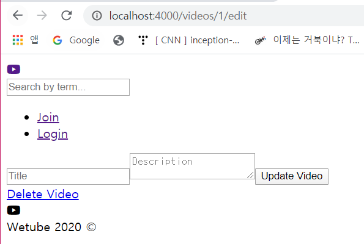

# Fix Error & Update EditVideo.pug / Upload.pug

### 1. Fix Error

- 이전에 /users/edit-profile에서 `Change Password` 링크를 누르면 경로 오류가 발생했었음

  /users/change-password로 가야하는데 /change-password로 이동해서 발생한 문제

  - editProfile.pug 수정

    <수정 전>

    ```
    extends layouts/main
    
    block content
        .form-container
            form(action=routes.editProfile, method="post")
                label(for="avatar") Avatar
                input(type="file", id="avatar", name="avatar")
                input(type="text", placeholder="Name", name="name")
                input(type="email", placeholder="Email", name="email")
                input(type="submit", value="Update Profile")
            a.form-container__link(href = routes.changePassword) Change Password
    
    ```

    <수정 후> 

    form 태그의 action 경로와 href의 경로를 변경해줌

    ```
    extends layouts/main
    
    block content
        .form-container
            form(action=`/users${routes.editProfile}`, method="post")
                label(for="avatar") Avatar
                input(type="file", id="avatar", name="avatar")
                input(type="text", placeholder="Name", name="name")
                input(type="email", placeholder="Email", name="email")
                input(type="submit", value="Update Profile")
            a.form-container__link(href = `/users${routes.changePassword}`) Change Password
    
    ```

    

### 2. editVideo.pug | upload.pug

- editVideo.pug

  ```
  extends layouts/main
  
  block content
      .form-container
          form(action=`/videos${routes.editVideo}`, method="post")
              input(type="text", placeholder="Title", name="title")
              textarea(name="description", placeholder="Description")
              input(type="submit", value="Update Video")
          a.form-container__link.form-container__link--delete(href=`/videos${routes.deleteVideo}`) Delete Video 
  ```

   

- upload.pug

  ```
  extends layouts/main
  
  block content
      .form-container
          form(action=`/videos${routes.upload}`, method="post")
              label(for="file") Video File
              input(type="file", id="file", name="file")
              input(type="text", placeholder="Title", name="title")
              textarea(name="description", placeholder="Description")
              input(type="submit", value="Upload Video")
  ```