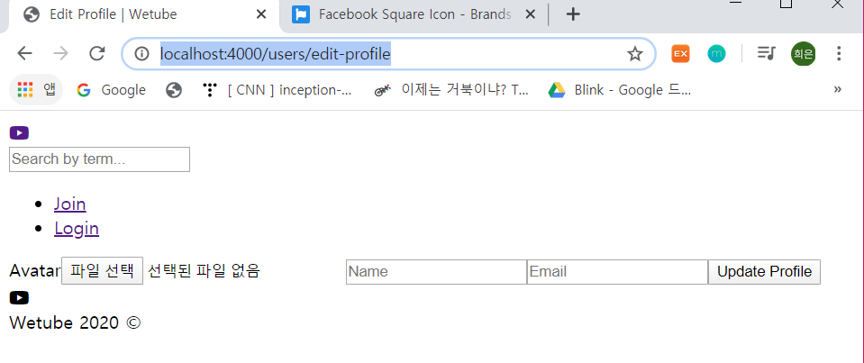

# Change Profile HTML

### +) 수정

- join.pug

  action에 경로를 사용하지 않고 routes 객체를 이용하면 됨

  ```
  extends layouts/main
  
  block content
      .form__container
          form(action=routes.join, method="post")
  ```

- login.pug도 마찬가지

  

### 1. Edit Profile

- editProfile.pug

  ```
  extends layouts/main
  
  block content
      .form__container
          form(action=routes.editProfile, method="post")
              label(for="avatar") Avatar
              input(type="file", id="avatar", name="avatar")
              input(type="text", placeholder="Name", name="name")
              input(type="email", placeholder="Email", name="email")
              input(type="submit", value="Update Profile")
  ```

  - `input(type="file")`은 아바타 편집을 위한 것

   

+) editProfile.pug | join.pug | login.pug

​	.form__container >>>> .form-container

- editProfile.pug에 changePassword로 이동하는 경로 설정 추가

  ```
  a.form-container__link(href = routes.changePassword) Change Password
  ```