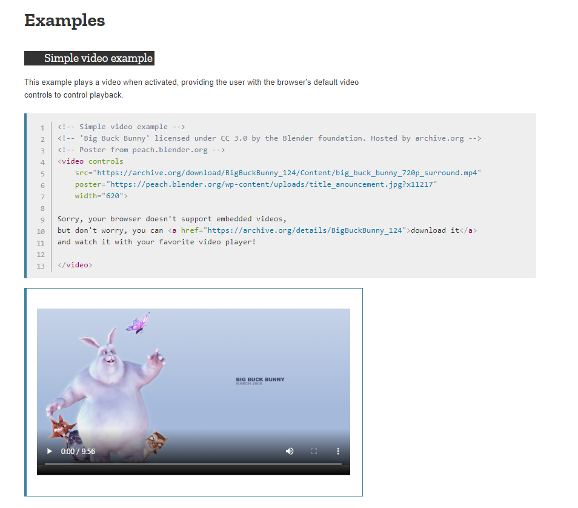
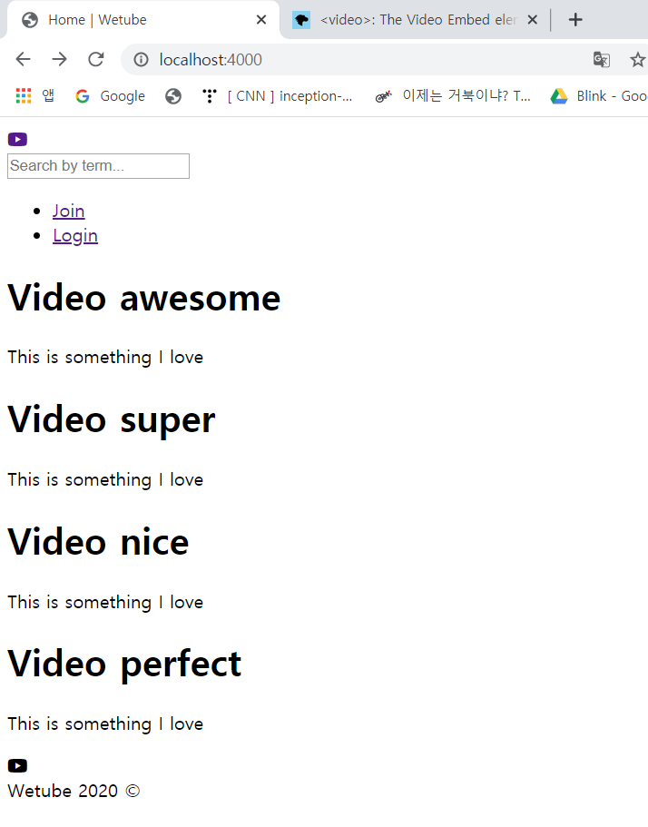

# Home Controller

### 1. Make Fake DB

- db.js 생성

  home 화면에서 video 목록을 보여줘야 함

  DB를 만들기 전에 가짜 데이터를 만들어 볼 것임 - DB에 무엇을 추가해야 할지 설정을 하기 전에 수정을 쉽게 하기 위해

  - html video mdn: 비디오 삽입 요소

    https://developer.mozilla.org/en-US/docs/Web/HTML/Element/Video

     

  ```js
  const video = [
      {
          id:32493,
          title: 'Video awesome',
          description: 'This is something I love',
          views: 24,
          videoFile: "https://archive.org/details/BigBuckBunny_124",
          creator: {
              id: 121212,
              name:"Heeeun",
              email:"hee@eun.com"
          }
      }
  ]
  ```

  

### 2. Video List 

- videoControllers.js의 home에서 video 목록을 받아서 render 함수에 전달

  videos:videos를 줄여서 videos

  ```js
  import {videos} from "../db"
  
  export const home = (req, res) => {
      res.render("home", { pageTitle : "Home", videos });
  };
  ```

  - 에러 발생 - 아래 코드 삭제

    ```js
    export const videos = (req, res) => res.render("videos", { pageTitle : "Videos" });
    ```

- home.pug

  위의 DB 속 가짜 데이터를 4번 copy&paste

  ```
  extends layouts/main
  
  block content
      .videos
          each video in videos
              h1= video.title
              p= video.description
  ```

   