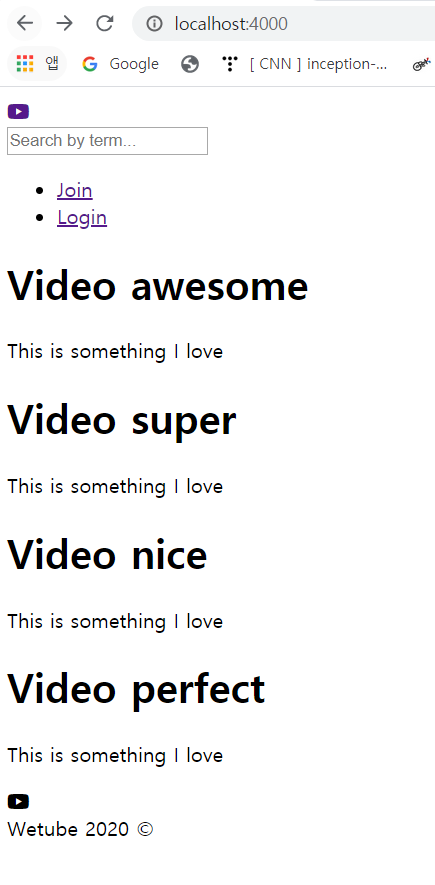
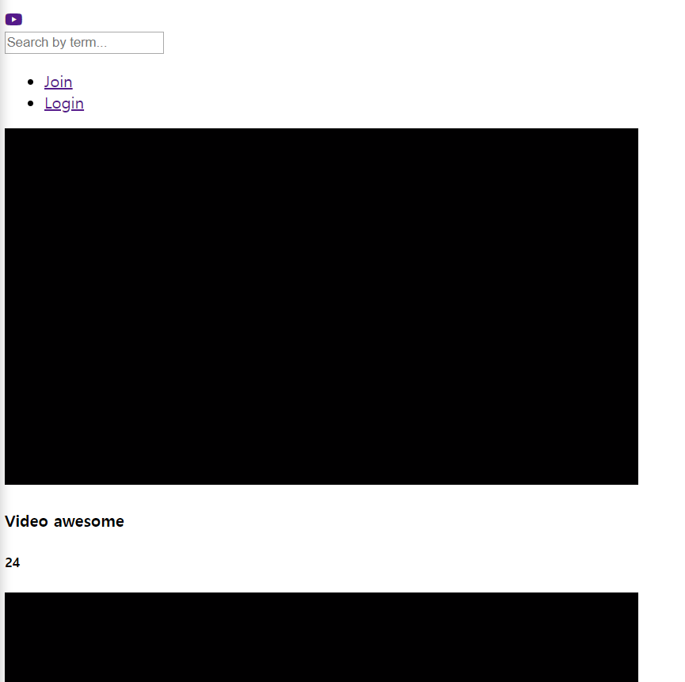

# Home Controller part2

### 1. Mixin: Reuse HTML

footer를 include해서 재활용하는 것처럼, 비디오 블록 html 코드를 만들 것임

- views/mixins 폴더 생성 - 웹사이트에서 자주 반복되는 html 코드를 담고 있음

- videoBlock.pug 생성

  `mixin()`: pug 함수의 일종

  ```
  mixin videoBlock(video = {})
      h1=video.title
      p.video.description
  ```

- hom.pug 수정

  ```
  extends layouts/main
  include mixins/videoBlock
  
  block content
      .videos
          each item in videos
              +videoBlock({
           	   //h1= video.title
  				//p=video.description
                  title:item.title,
                  description: item.description
              })      
  ```

   

- 각각 다른 정보를 가지지만 같은 구조를 가지는 데이터를 표시하기 위해 코드를 캡슐화

  mixin을 사용하는 이유 : **다른 정보, 같은 구조**

  

### 2. mixin on videoBlock.pug

- videoBlock.pug

  `controls=true`: **비디오에 컨트롤 기능을 추가시켜줌**

  ```
  mixin videoBlock(video = {})
      .videoBlock
          video.videoBlock__thumbnail(src=video.videoFile, controls=true)
          h4.videoBlock__title=video.title
          h5.videoBlock__views=video.views
  ```

- home.pug

  ```
  extends layouts/main
  include mixins/videoBlock
  
  block content
      .videos
          each item in videos
              +videoBlock({
                  title:item.title,
                  views:item.views,
                  videoFile:item.videoFile
              })
  ```

  