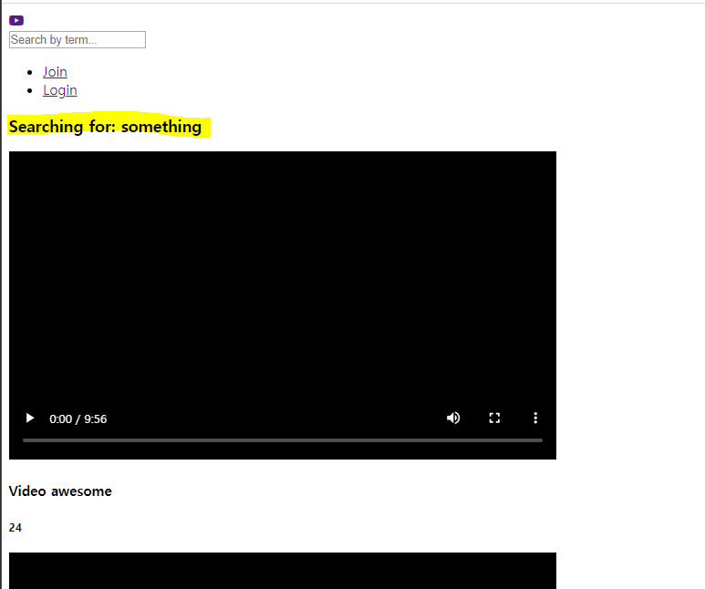
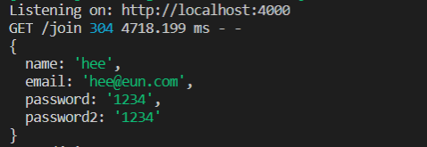
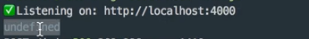
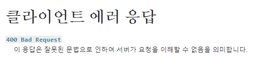
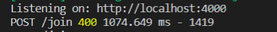

# Join Controller

### 1. Search Function

- videoController.js

  render 변수 `videos` 추가

  DB가 없기 때문에 기능 구현은 나중에 진행

  ```js
  export const search = (req, res) => {
      const {query: {term: searchingBy}} = req;
      res.render("Search", { pageTitle : "Search", searchingBy, videos});
  };
  ```

- search.pug

  `.search__videos` function을 만든 후, home.pug의 include 부분과, `.videos` 부분 copy

  `videos`를 가져와야 home 화면에서도 비디오가 보이고, search 화면으로 가도 비디오가 보임

  ```
  extends layouts/main
  include mixins/videoBlock
  
  block content
      .search__header
          h3 Searching for: #{searchingBy}
      .search__videos
          each item in videos
              +videoBlock({
                  title:item.title,
                  views:item.views,
                  videoFile:item.videoFile
              })
  ```

  


### 2. Join Function

회원가입을 하면 자동으로 Login 후 Home 화면으로 이동하도록 구현

- userController.js

  로그인 할 때 userController를 사용 -> join function

  join 화면에서 name, emaii, pw, verify pw를 입력하고 join을 클릭하면 '/join'으로 POST 할 수 없다는 에러 발생 - /join 경로로 POST 하기 위한 설정이나 코드가 없기 때문

  join의 이름을 더 정확하게 getJoin으로 바꾸고, postJoin이라는 함수를 새로 만듦

- globalRouter.js 수정

  라우터들을 조금씩 분리 가능 (컨트롤러나 페이지도 분리 가능)

  ```js
  import { getJoin, postJoin } from "../controllers/userController";
  
  // globalRouter.get(routes.join, join);
  globalRouter.get(routes.join, getJoin);
  globalRouter.post(routes.join, postJoin);
  ```

- userController.js의 postJoin에서 console.log(req.body)

  ```js
  export const postJoin = (req, res) => {
      console.log(req.body)
      res.render("join", { pageTitle : "Join" })
  };
  ```

- join 페이지에서 값들을 입력한 뒤 `Join Now`버튼을 클릭하면,  post로 이동해서 join 화면을 render 하고 있음

  아래와 같이 form에서 전송한 데이터를 받고 있는 것을 확인 가능

   

- **app.js에서 bodyParser를 삭제하면?**

  ```js
  app.use(bodyParser.json());
  app.use(bodyParser.urlencoded({extended: true}));
  ```

  콘솔을 확인하면 아래와 같이 `undefined`라고 뜸 - 사용자가 전송한 정보를 알 수 없음

   


### 3. ECMAScript6

req 안에 있는 body에서 `name`, `email`, `password`, `password2`를 가져오기 위해 사용

- status code

  만약 password와 password2가 다르다면 상태 코드를 전달할 것임

  https://developer.mozilla.org/ko/docs/Web/HTTP/Status

   

- userController.js

  request의   body 내용을 받고, 만약 password와 password2가 다르다면 status코드 client에게 400을 전송해 잘못된 요청임을 알림

  password와 password2가 같다면 home으로 이동

  ```js
  import routes from "../routes";
  
  export const postJoin = (req, res) => {
      const{
          body: {name, email, password, password2}
      } = req;
      if(password !== password2){
          res.status(400);
          res.render("join", { pageTitle : "Join" })
      } else{
          //To Do Register User
          //To Do Log User in
          res.redirect(routes.home);
      }
  };
  ```

  - 비밀번호가 다를 경우 콘솔창에 400 에러가 난 것을 확인 가능

     