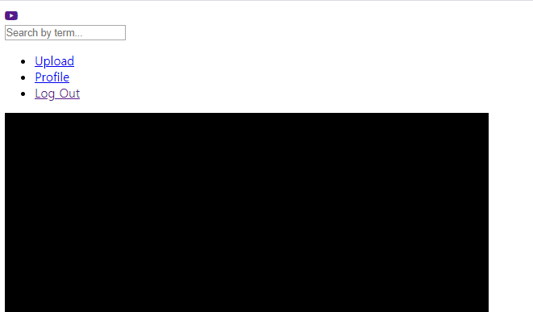
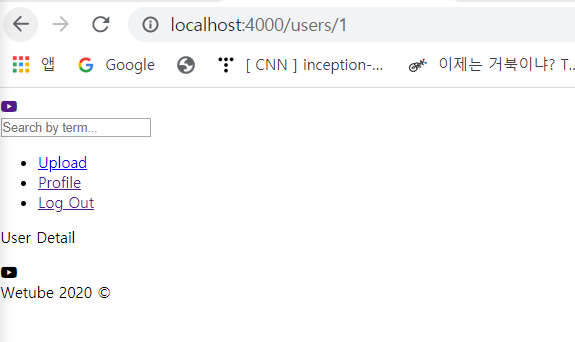

# Log In and User Profile Controller

### 1. Login Function

- userController.js

  Login도 Join과 같이 `get`, `post`로 나눔

  ```js
  export const getLogin = (req, res) => res.render("login", { pageTitle : "Login" });
  export const postLogin = (req, res) =>{
      res.redirect(routes.home);
  }
  ```

- globalRouter.js

  ```js
  import { getLogin, postLogin } from "../controllers/userController";
  
  globalRouter.get(routes.login, getLogin);
  globalRouter.post(routes.login, postLogin);
  ```

  

### 2. Update Navigation

- header.pug	

  ```
      .header__column
          ul 
              if !user.isAuthenticated
                  li
                      a(href=routes.join) Join
                  li
                      a(href=routes.login) Login
              else
                  li
                      a(href=routes.upload) Upload
                  li
                      a(href=routes.userDetail) Profile
                  li
                      a(href=routes.logout) Log Out                    
  ```


### 3. isAuthenticated

- middlewares.js

  middleware에 아래와 같이 추가 - 존재하지 않는 가짜 정보임, 실제 사용자 정보가 있으면 대체됨

  ```
      res.locals.user = {
          isAutenticated: true,
          id: 1
      };
  ```

- 만약 user.isAutenticated가 true이면 header.pug의 else문 실행

  middlewares.js에 가짜로 isAutenticated true를 줬기 때문에 아래와 같은 화면을 얻을 수 있음

   


### 4. Profile

지금은 profile 링크를 누르면 `http://localhost:4000/:id`로 이동

만약 user에 id가 있다면 id가 포함된 주소로 이동하도록 수정해야 함

미들웨어에 설정된 id가 url에 들어가도록 routes를 수정

- 왜 동작하지 않는가?

  express는 "/:id"를 이해하지만 HTML은 저 routes를 이해하지 못 하기 때문

- routes.js

  `userDetail: USER_DETAIL`  수정

  ```JS
  const routes = {
      userDetail: (id) => {
          if(id){
              return `/users/${id}`;
          } else{
              return USER_DETAIL;
          }
      }
  };
  ```

- userRouter.js

  `userRouter.get(routes.userDetail, userDetail);` 수정

  위에서 만든 userDetail()함수를 실행해야 하므로

  ```js
  userRouter.get(routes.userDetail(), userDetail);
  ```

- header.pug

  `a(href=routes.userDetail) Profile` 수정

  ```
  a(href=routes.userDetail(user.id)) Profile
  ```

   


### 5. Update URL

id와 함께 실행해야 하는 URL들을 수정해줘야 함

- routes.js

  `videoDetail` 수정

  ```js
      videoDetail: (id) => {
          if(id){
              return `/videos/${id}`;
          } else{
              return VIDEO_DETAIL;
          }
      },
  ```