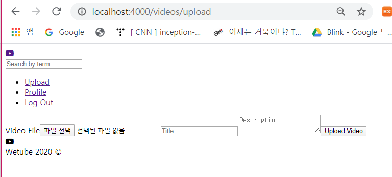

# More Controllers

### 1. Video Detail

비디오를 클릭하면 비디오 상세 페이지로 이동하도록 수정

- mixins/videoBlock.pug

  ```
  mixin videoBlock(video = {})
      .videoBlock
          a(href=routes.videoDetail(video.id))
              video.videoBlock__thumbnail(src=video.videoFile, controls=true)
              h4.videoBlock__title=video.title
              h5.videoBlock__views=video.views
  ```

- videoBlock을 사용하는 home.pug 수정

  videoBlock에 id 추가

  ```
  +videoBlock({
      id: item.id,
      title:item.title,
      views:item.views,
      videoFile:item.videoFile
  })
  ```

- videoRouter.js 수정

  routes.videoDetail에서 routes.videoDetail()로 - videoDetail을 함수로 선언했기 때문

  ```js
  videoRouter.get(routes.videoDetail(), videoDetail);
  ```

  

### 2. Logout

로그아웃을 클릭하면 로그아웃 페이지로 가는 것이 아니라 로그아웃 처리를 한 후, home 페이지로 redirect 되도록 수정

- userController.js

  logout 수정

  ```js
  export const logout = (req, res) =>{
      //To Do: Process Log Out
      res.redirect(routes.home);
  }
  ```

- logout 페이지는 필요 없으므로 logout.pug 파일 삭제


### 3. Upload

upload를 클릭하면 `Cannot GET /upload`라는 에러 발생

- 이유: /upload가 아닌 /videos/upload로 이동해야 함

  header.pug 수정

  ```
  //a(href=routes.upload) Upload
  a(href=`/videos${routes.upload}`) Upload
  ```

  아래와 같이 정상적으로 동작하는 것 확인 가능

  

- videoControllers.js 수정 

  upload.pug를 보면 form이 method post로 요청하는데 이 요청에 응답할 수 있어야 함 - getUpload와 postUpload 생성

  ```js
  //default export일 때는 import {routes}가 아니라 import routes
  import routes from "../routes"
  
  export const getUpload = (req, res) => res.render("upload", { pageTitle : "Upload" });
  
  export const postUpload = (req, res) => {
      const {
          body:{file, name, description}
      } = req;
      // To Do: Upload and save Video
      res.redirect(routes.videoDetail(324393)) //임시로 id를 전송
  }
  ```

- videoRouter.js

  ```
  import { getUpload, postUpload } from "../controllers/videoController";
  
  videoRouter.get(routes.upload, getUpload);
  videoRouter.post(routes.upload,postUpload);
  ```

  

### 4. Security

upload 페이지에서 아무 정보를 입력하지 않고 upload 해도 비디오 상세 페이지로 이동함 

- upload.pug

  3개의 input에 `required=true` 추가

  ```
  input(type="file", id="file", name="file", required=true)
  input(type="text", placeholder="Title", name="title", required=true)
  textarea(name="description", placeholder="Description", required=true)
  ```

- join.pug

  같은 작업 수행

  ```
  input(type="text", name="name", placeholder="Full Name", required=true)
  input(type="email", name="email", placeholder="Email", required=true)
  input(type="password", name="password", placeholder="Password", required=true)
  input(type="password", name="password2", placeholder="Verify Password", required=true)
  ```

- login.pug

  같은 작업 수행

  ```
  input(type="email", name="email", placeholder="Email", required=true)
  input(type="password", name="password", placeholder="Password", required=true)
  ```