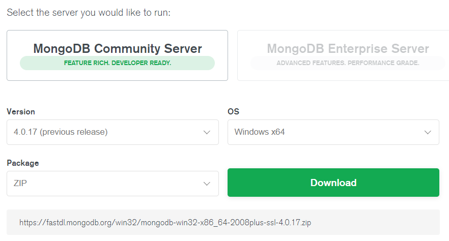

# MongoDB and Mongoose

### 1. Download MongoDB

https://www.mongodb.com/download-center/community

 


### 2. Install Adapter, Mongoose

JavaScript에서 MongoDB와 연결하려면 Adapter 설치 필요

javascript 코드를 작성하기 위해서는 MongoDB로부터 Instruction을 받아야 함

- Mongoosejs

  https://mongoosejs.com/

  NodeJS를 위한 Object Modeling

  ```
  npm install mongoose
  ```