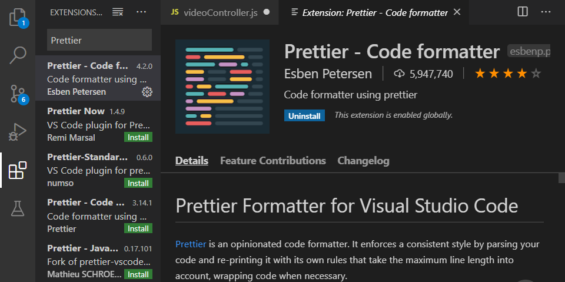
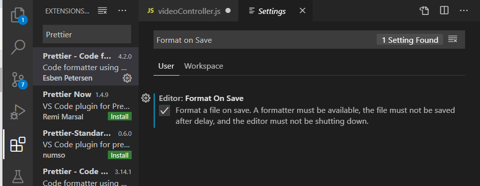

# Installing ESLint

### 1. New One Comes First

- 최신 비디오를 위로 올리기 위해 videoController.js 수정

  ```js
  //const videos = await Video.find({});
  const videos = await Video.find({}).sort({ _id:-1})
  ```

  

### 2. ESLint

- **Linter**: Visual Studio Code에서 사용 가능한 것으로, 사용자의 코드에서의 좋은점 그리고 문제점을 알려줌

  https://eslint.org/

- 아래 방법이 안되서 visualCode에서 주는 plug-in 설치함

  https://marketplace.visualstudio.com/items?itemName=dbaeumer.vscode-eslint

  > console
  >
  > 절대 global하게 install하지 말 것!!!

  ```
  npm install eslint 
  ```

- 설치가 끝나면 아래와 같이 입력

  ````
  npx eslint --init
  ````

  - 3가지 옵션이 있음 - 2번 선택
    1. 문법만 검사
    2. 문법을 검사하고 문제 발견
    3. 문법 검사, 문제 발견 그리고 코드 스타일 변경

  - 프로젝트가 어떤 모듈으르 사용하는지 - 1번 선택
    1. JavaScript  modules
    2. CommonJS
    3. None of these

- pakage.json에서 확인 가능

  ```json
    "devDependencies": {
      "@typescript-eslint/eslint-plugin": "^2.27.0",
      "@typescript-eslint/parser": "^2.27.0",
      "eslint": "^6.8.0",
      //"nodemon": "^2.0.2"
    }
  ```

- `.eslintrc.js` 파일이 생성된 것을 알 수 있음

- eslint가 코딩 스타일에는 관여하지 않도록 prettier 설치

  ```
  npm install eslint-config-prettier
  ```


### 3. Installing Prettier in Visual Studio Code

- javascript를 저장할 때마다 자동적으로 포멧에 맞춰 깔끔하게 만들어줌

   

- settings에서 format on save 체크

   