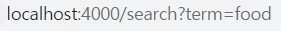
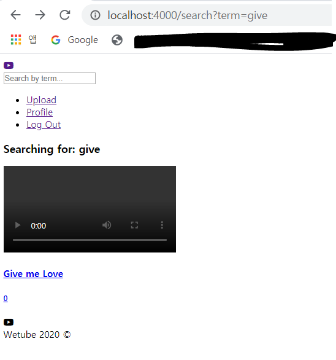
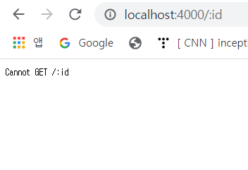

# Searching Videos

### 1. Search Function

- VideoController.js에서 search가 searchingBy를 갖고 있어서, 검색어를 입력하면 url에 아래와 같이 검색어가 붙게 됨

   

- 검색한 것과 정확히 일치하는 것과 함께, 내가 찾는 단어가 포함된 결과도 얻도록 하고 싶음

  - 검색한 것과 정확히 일치하는 것만을 얻으려면 아래와 같이 해주면 됨

    ```js
    videos = await Video.find( title:seachingBy )
    ```

  - 포함된 결과를 얻으려면 mongoose에 regex를 이용해야 함 - Regular Expression (정규표현식)

    또, 대소문자 구분을 하지 않기 위해 `$options: "i"`를 추가 -`i: insensitive`

    ```js
    videos = await Video.find({ title: { $regex: searchingBy, $options: "i" }})
    ```

- VideoController.js

  ```js
  export const search = async (req, res) => {
    const {
      query: { term: searchingBy },
    } = req;
  
    let videos = [];
  
    try {
      videos = await Video.find({
        title: { $regex: searchingBy, $options: "i" },
      });
    } catch (error) {
      console.log(error);
    }
    res.render("Search", { pageTitle: "Search", searchingBy, videos });
  };
  ```

- 검색 작동 확인

   

- search.pug에서 비디오가 없을 경우 없다고 표시

  ```
  if videos.length === 0
  	h5 No Videos Found
  ```

  

### 2. Fix OurMixin

- 위의 검색 작동 페이지에서 동영상 상세 페이지를 받아오지 못 함

   

- VideoBlock.pug에서는 해당 video를 찾기 위해 id가 필요한데 search.pug에서 어떤 id도 할당하지 않아 에러 발생 -> search.pug 에서 videoBlock에 id 추가

  ```
  +videoBlock({
                  id:item.id,
              })
  ```


### 3. Error in VideoDetail

- videodetail에 comment 수가 ~comment 이런 식으로 나왔으면 좋겠음 -> videoDetail.pug 수정

  ```
      .video__comments
          if video.comments.length === 1
              span.video__comment-number 1 comment
          else
              span.video__comment-number #{video.comments.length} comments 
  ```

  