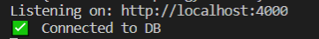

# Connecting to MongoDB

### 1. dotenv

- install dotenv

  ```
  npm install dotenv
  ```
  - dotenv를 설치한 이유

    가끔 어떤 부분을 숨겨야 할 때가 있기 때문

    지금은 localhost에 설치되어 있지만 다른 곳에 설치 된다면??

- db.js

  ```js
  import mongoose from "mongoose";
  
  mongoose.connect(
    "mongodb://localhost:27017/we-tube",
    {
      useNewUrlParser: true,
      useFindAndModify: false
    }
  );
  
  const db = mongoose.connection;
  
  const handleOpen = () => console.log("✅  Connected to DB");
  const handleError = error => console.log(`❌ Error on DB Connection:${error}`);
  
  db.once("open", handleOpen);
  db.on("error", handleError);
  ```

   

  - 연결이 되어 있는 이유

    `videoController`에서 db를 불러왔기 때문

    ```js
    import {videos} from "../db"
    ```

- videoController.js에서 아래 코드 삭제

  ```js
  import {videos} from "../db"
  ```

- init.js에 아래 코드 삽입

  ```js
  import "./db"
  ```