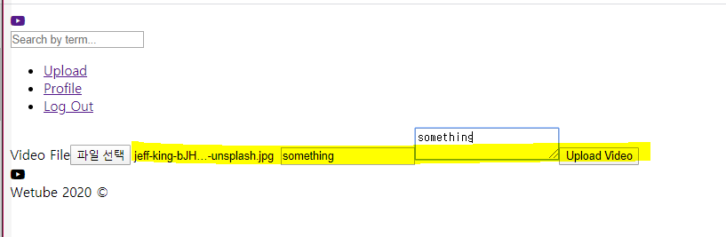
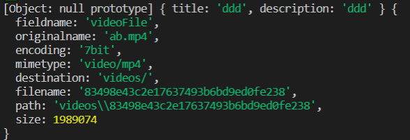
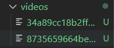
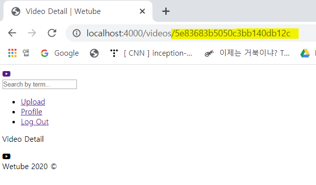
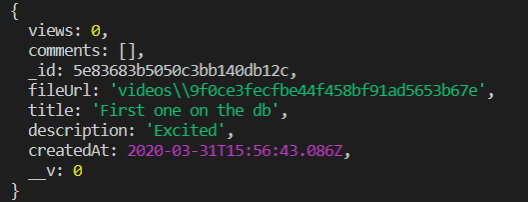

# Uploading and Creating a Video

### 1. Check the Information

- videoController.js

  postUpload 아래에 `console.log`를 통해 file, title, description 확인

  ```js
  export const postUpload = (req, res) => {
      const {
          body:{file, title, description}
      } = req;
      console.log(file, title, description)
  ```

- localhost:4000/videos/upload

  임의의 파일을 선택하고 title, description을 작성한 뒤 콘솔을 작성해보면 file, title, description을 출력하는 것을 확인 가능

  

   

- 하지만 우리는 file은 필요 없음. location만 얻으면 됨

  file 자체를 저장하는 것이 아니라 file을 location을 저장


### 2. Video Files Only

- upload.pug

  `accept = "video"`  추가해주면 동영상이 아닌 파일은 선택할 수 없게 됨

  ```
  input(type="file", id="file", name="file", required=true, accept = "video/*")
  ```


### 3. Middleware Multer

file을 upload하고 url을 반환하는 middleware 설정

**multer**라는 middleware를 사용할 것임

https://github.com/expressjs/multer/blob/master/doc/README-ko.md

- install multer

  ```
  npm install multer	
  ```

- upload.pug의 enctype에 `multipart/form-data`를 추가해야 함

  ```
  //form(action=`/videos${routes.upload}`, method="post")
  form(action=`/videos${routes.upload}`, method="post", enctype="multipart/form-data")
  ```

- middlewares.js

  `single`: 오직 하나의 파일만 업로드 할 수 있음을 의미

  `videoFile`: upload.pug에서 file이 갖는 name

  ```js
  import multer from "multer";
  
  const multerVideo = multer({dest: "videos/" });
  ...
  
  export const uploadVideo = multerVideo.single("videoFile");
  ```

- videoRouter.js

  ```js
  //videoRouter.post(routes.upload,postUpload);
  videoRouter.post(routes.upload, uploadVideo, postUpload);
  ```

- 우리가 file을 Upload하면 server에 있는 folder(videos/)에 upload됨

  그리고 나서 postupload function은 해당 파일에 접근할 것임

  file 방식이 아닌 URL 방식으로 진행

- videoController.js

  ```js
  export const postUpload = (req, res) => {
      const { body, file } = req;
      console.log(body, file);
      res.render("upload", { pageTitle : "Upload" });
      // To Do: Upload and save Video
      //res.redirect(routes.videoDetail(324393))
  ```

  파일을 업로드 하면 아래와 같이 정보가 뜸

  **path**가 바로 우리가 원하던 것

    

  그리고 moltar가 자동적으로 만든 file을 확인 가능

   


### 4. Let's Create a Video with URL

- videoController.js

  이제 file을 form으로부터 받아올 필요가 없고 path로 받아올 수 있음

  ```js
  export const postUpload = (req, res) => {
      const { 
          body: {title, description},
          file: {path}
       } = req;
  ```

- VideoController.js에서 async 추가

  새로운 video 만드는 것을 구현할 것임

  ```js
  export const postUpload = async(req, res) => {
      const { 
          body: {title, description},
          file: {path}
       } = req;
       const newVideo = await Video.create({
          fileUrl: path,
          title,
          description
       })
       console.log(newVideo)
       res.redirect(routes.videoDetail(newVideo.id));
  ```

- 이제 업로드를 하면 url 뒤에 id가 붙는 것을 확인 가능

   

  또 아래와 같이 newVideo 정보 확인 가능

   