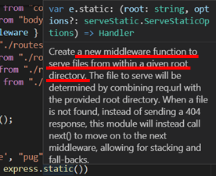
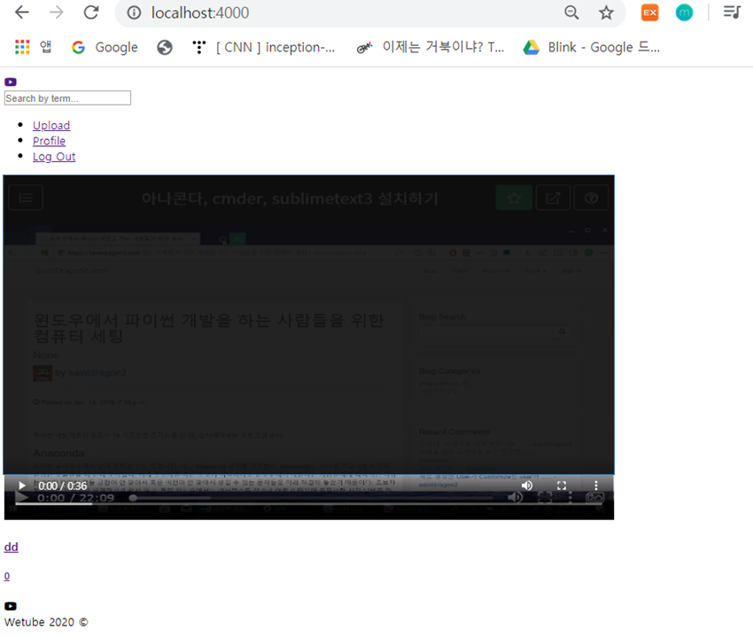

# Uploading and Creating a Video part Two

### 1. uploads/videos/

- Video를 업로드 해도 link가 망가졌기 때문에 video들이 나타나지 않음

  먼저 Video 폴더를 지우고 middlewares.js를 수정

  `/uploads/video`라고 적지 않는 것이 **중요** 

  - 이렇게 적으면 해당 위치가 projectfile 안에 있는 directory라고 생각하기 때문

    이렇게 적을 시에 컴퓨터 root에 upload를 만들 것임

  ```js
  // const multerVideo = multer({dest: "videos/" });
  const multerVideo = multer({dest: "uploads/videos/" });
  ```


### 2. How to Use MongoDB

- MongoDB model이 한 document를 DB에 저장했고 이 document는 잘못된 URL을 갖고 있음

  이를 해결하기 위해 MongoDB 조작 필요

- start MongoDB

  ```
  mongo
  ```

- db 목록 확인

  ```
  show dbs
  ```

- db 사용

  ```
  use [db name]
  ```

- 테이블 확인

  ```
  show collections
  ```

- videos 테이블 삭제

  ```
  db.videos.remove({})
  ```


### 3. Uploading to the New Destination

- 1에서 바꾼 `uploads/videos/` 경로로 upload

   

- 동작하지 않음

  express에서 우리는 route.js에 모든 route들을 적어줌

  uploads에 대한 경로도 정의해주어야 함

  - app.js에 추가

    만약 누군가 /uploads로 간다면, directory에서 file을 보내주는 middleware인 express.static()을 사용하도록 함 

    이 경우에는 controller나 view 같은 건 확인하지 않고 그냥 file만 확인함

    괄호 안에는 directory 명을 적어줌

    이제 /uploads로 가면 upload라는 directory 안으로 들어감을 명시해줌

    ```js
    app.use("/uploads", express.static("uploads"))
    ```

     

  - ERROR 해결

    home.pug에서 videoFile:item.videoFile로 해서 오류 발생

    하지만 videoController.js에서 postUpload를 보면 fileUrl 변수를 사용하는 것 확인 가능

    따라서 home.pug를 videoFile:item.fileUrl로 바꿔주면 해결

- video 업로드 확인

   


### 4. Problems

- 이렇게 user에 해당하는 파일을 server에 저장하는 것은 좋은 방법이 아님 

  이건 단지 test를 위한 것이고 static file의 장점을 보여주기 위함임

  하지만, static file은 front-end에서 쓰이는 javascript나 css 로고 file임

  그러므로 user와 같이 생성된 data는 server와 분리되어야 함

  -> 나중에 다룰 부분

  - 또 다른 문제점 

    사용자가 업로드한 데이터를 이렇게 다 server에 저장할 경우 user가 매우 큰 file을 upload해서 server를 막아버릴 수 있음