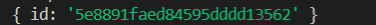
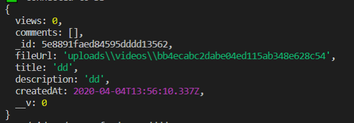
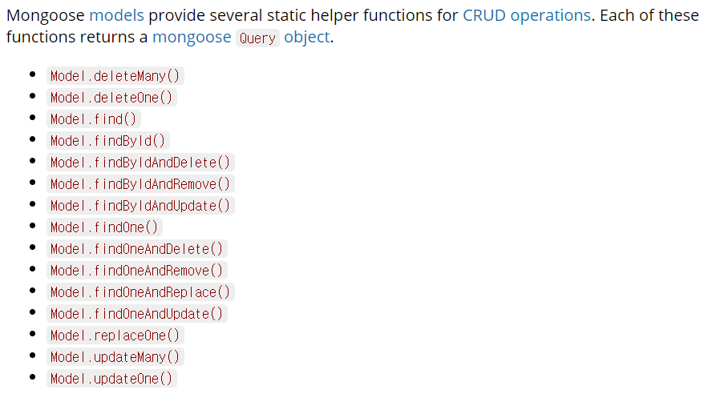

# Getting Video by ID

### 1. Get the Video ID

- videoController.js에서 videoDetail 수정 - console.log를 통해 request의 파라미터 확인

  ```js
export const videoDetail = (req, res) => {
      console.log(req.params);
    res.render("videoDetail", { pageTitle : "Video Detail" });
  }
```
  
console창에 아래와 같이 id를 띄워줌. **하지만** 이건 오직 이름이 id일 때만 성립
  
   
  
  왜냐면 route.js에 `/:id`를 갖고 있기 때문
  
  만약 route.js에서 `const VIDEO_DETAIL = /:potato`라고 변경한다면 콘솔창에 id:대신 potato:~ 형식으로 나타날 것임

- params로부터 ID 가져오기

  videoController.js를 수정하면 아래와 같이 video 정보를 알려주는 것을 확인 가능

  ```js
  export const videoDetail = async (req, res) => {
      const {
          params: { id }
      } = req;
      const video = await Video.findById(id);
      console.log(video);
      res.render("videoDetail", { pageTitle : "Video Detail" });
  };
  ```

   

  - mongoose의 option

    https://mongoosejs.com/docs/queries.html에서 확인 가능

    코드를 보면 await가 없는 등 조금 형태가 다름 - 예전 문법이기 때문: 많은 정보가 있고 그 뒤에 function 존재함. function을 놓는 대신 await를 사용할 것임

    

  - **try catch**를 사용해 에러 잡아내기

    에러가 난다면 home으로 이동하도록 설정

    ```js
    export const videoDetail = async (req, res) => {
        const {
            params: { id }
        } = req;
        try{
            const video = await Video.findById(id);
            res.render("videoDetail", { pageTitle : "Video Detail" });
        } catch(error){
            console.log(error);
            res.redirect(routes.home);
        }
    };
    ```

- videoController.js에서 render할 때 video 변수를 템플릿에 전달

  `video:video`는 `video`와 같기 때문에 video라고만 적어줌

  ```js
  //res.render("videoDetail", { pageTitle : "Video Detail" });
  res.render("videoDetail", { pageTitle : "Video Detail", video });
  ```


### 2. Change the VideoDetail Template

- models/video.js를에서 videoSchema 확인해 videoDetail.pug 작성

  - video(src=`/${video.fileUrl}`)에서 `/`를 붙여줘야 경로 오류를 막을 수 있음

  ```
  extends layouts/main
  
  block content
      .video__player
          video(src=`/${video.fileUrl}`)
      .video__info
          h5.video__title=video.title
          span.video__views=video.views
          p.video__description=video.description
  ```

  videoDetail 페이지를 보면 동영상, title, views, description이 잘 나오는 것을 확인 가능

- 비디오 주인한테만 보이는 button 생성

  우선 누구든 사용할 수 있게 기능을 구현한 다음 나중에 user part에서 주인에게만 권한 부여

  ```
  .video__info
          a(href=routes.editVideo) Edit Video
  ```