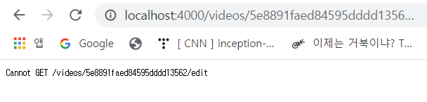
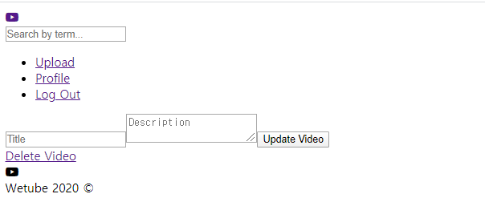
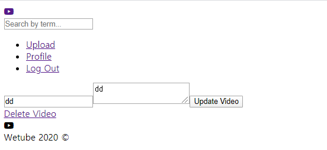

Editing a Video

### 1. Change the editVideo Route

- route.js에서 editVideo 경로 수정
```js
      editVideo: (id) => {
        if(id){
              return `/videos/${id}/edit`
          } else {
              return EDIT_VIDEO;
          }
      }
```

- videoDetail.pug에서 경로 수정

  videoController에서 video 파일을 통으로 줬으므로 video.id를 괄호에 입력

  ```
  a(href=routes.editVideo(video.id)) Edit Video
  ```

- 이제 `Edit Video`를 누르면 videos/id/edit으로 가게 됨

   

- videoRouter.js에서 routes.editvideo는 더 이상 string이 아닌 function임

  우리는 함수를 실행해야 함

  ```js
  //videoRouter.get(routes.editVideo, editVideo);
  videoRouter.get(routes.editVideo(), editVideo);
  ```

  이제 edit page가 정상적으로 작동

   

- 유저가 비디오를 수정할 때 제목이나 설명은 변경해도 비디오를 재 업로드하는 것은 허용X

  그래서 edit page에 video 파일 업로드하는 기능이 없음

  새로운 파일을 업로드하고 싶으면 새로운 비디오를 업로드 해야 함


###  2. Update getEditVideo

- editvideo 페이지에 title과 description이 적혀있도록 할 것임

  이 부분은 getEditVideo가 하는 작업

  - videoController.js

    ```js
    // export const getEditVideo = (req, res) => res.render("editVideo", { pageTitle : "Edit Video" });
    export const getEditVideo = async (req, res) => {
        const{
            params: {id}
        } = req;
        try{
            const video = await Video.findById(id);
            res.render("editVideo", {pageTitle: `Edit ${video.title}`, video});
        } catch(error){
            res.redirect(routes.home);
        }
    };
    ```

  - editVideo.pug

    text input에는 `value=video.title`을 추가해주고 textarea에는 뒤에 `=video.description`을  추가

    그리고 action에 해당하는 경로 수정 - `videos/${routes.editVideo()}` => `routes.editVideo(video.id)`

    textarea에는 **value**가 없음!

    ```
    form(action=`${routes.editVideo(video.id)}`, method="post")
    	input(type="text", placeholder="Title", name="title", value=video.title)
    	textarea(name="description", placeholder="Description")=video.description
    ```

    이제 title과 description이 적용된 것을 확인 가능

     

    

### 3. Edit Video

- videoController.js

  editVideo를 getEditVideo로 수정한 뒤 postEditVideo 생성

  ```js
  export const getEditVideo = (req, res) => res.render("editVideo", { pageTitle : "Edit Video" });
  
  export const postEditVideo = (req, res) => {
  
  };
  ```

- videoRouter.js

  import 부분 수정하고 editVideo Router 수정

  ```js
  import { postEditVideo, getEditVideo } from "../controllers/videoController";
  
  const videoRouter = express.Router();
  
  videoRouter.get(routes.editVideo(), getEditVideo);
  videoRouter.post(routes.editVideo(), postEditVideo);
  ```

- videoController.js

  - mongoose를 보면 `findOneAndUpdate`라는 기능이 있음: 업데이트된 내용을 새로운 변수에 저장하는 것이 아니라 그냥 업데이트만 하고 끝내길 원함

    조건으로는 비디오를 찾아줄 id를 넣고, body의 title과 description을 넣어줌

    title: title과 title은 같은데 깔끔하게 작성하기 위해 `title` 사용

    title과 description은 model의 일부였음 그렇기 때문에 같은 이름으로 작성해주어야 함

    ```js
    await Video.findOneAndUpdate({ _id: id }, {title, description});
    ```

  - id, title과 description을 body에서 얻기 위해 const{}안에 아래와 같이 작성

    ```js
    const{
            params: {id},
            body: {title, description}
        } = req;
    ```

  - 업데이트 이후에는 해당 비디오의 video detail로 redirect

    ```
    res.redirect(routes.videoDetail(id));
    ```

  - 전체 코드

    ```js
    export const postEditVideo = async(req, res) => {
        const{
            params: {id},
            body: {title, description}
        } = req;
        try{
            await Video.findOneAndUpdate({ id }, {title, description});
            res.redirect(routes.videoDetail(id));
        } catch(error){
            res.redirect(routes.home);
        }
    };
    ```