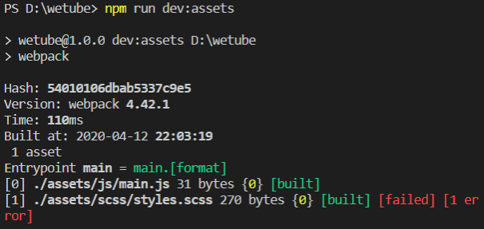

# Introduction to Webpack

### 1. Webpack

- module bundler로, 우리가 webpack에게 파일을 주면 webpack은 그 파일들을 완전히 호환되는 static 파일들로 변환해 줌

- 최신의 자바스크립트를 webpack에 넣으면 오래된 자바스크립트로 변환해 브라우저가 알아들을 수 있도록 해줌

- Install

  webpack은 파일에서 webpack을 사용하기 위함이고, webpack-cli는 터미널에서 webpack을 쓸 수 있게 해줌

  ```
  npm install webpack webpack-cli
  ```

- webpack.config.js

  설치를 하면 webpack.config.js 파일을 만들어줘야 함

- package.json에서 start 명령어를 변경

  이제는 `npm run dev:server` 와 `npm run dev:assets`로 각자 다른 콘솔에서 실행시켜야 함

  `dev:assets`는 webpack을 불러오기 위함 - 자동적으로 webpack.config.js 파일을 찾음(파일명 유지해야 함)

  ```json
    //"scripts": {
    // "start": "nodemon --exec babel-node init.js --delay 2"
    //},
  
    "scripts": {
      "dev:server": "nodemon --exec babel-node init.js --delay 2",
      "dev:assets": "webpack"
    },
  ```


### 2. webpack.config.js

- 주의: server 코드와는 연관시키지 않아야 함, 이건 100% client code임을 명심할 것

- 먼저 새로운 config를 만들 것임 - 아직 babel-node(prettier)는 사용할 수 없으므로 옛날 자바스크립트를 사용

  ```js
  const config = {};
  
  module.exports = config;
  ```

- 작업할 폴더인 assets 생성

  그 아래 js/main.js 와 scss/styles.scss 파일 생성

- main.js

  ```js
  import "../scss/styles.scss";
  ```

- styles.scss

  ```css
  body {
    background-color: red;
  }
  ```

- webpack.config.js

  Node.js에는 파일과 디렉토리 경로를 absolute로 만들어주는 방법이 있음

  다시 말해, 컴퓨터나 서버에서의 전체 경로를 갖게 되는 것

  `path`는 node.js에 기본으로 깔려있는 패키지로 전체 경로를 갖게 해줌

  ```js
  const path = require("path");
  // import path from "path"; 와 같은 역할 - 옛날 자바스크립트를 사용해야하기 때문에 위와 같이 작성
  
  const ENTRY_FILE = path.resolve(__dirname, "assets", "js", "main.js");
  const OUTPUT_DIR = path.join(__dirname, "static");
  
  const config = {
    entry: ENTRY_FILE,
    output: {
      path: OUTPUT_DIR,
      filename: "[name].[format]",
    },
  };
  
  module.exports = config;
  ```

  - `output`은 object여야 하므로 `{}`을 열고, path는 `OUTPUT_DIR`, filename은 현재 entry 파일이 하나밖에 없으므로 `[name].[format]`으로 설정

- npm run dev:assets

  styles.scss에서 failed 된 것을 확인 가능

   

  - webpack이 scss 파일 형식을 이해하지 못해서 에러 발생

    webpack에게 사용할 모든 파일 형식을 가르쳐줘야만 작동 (ex. png 파일이라면 어떻게 변환해야 하는지)