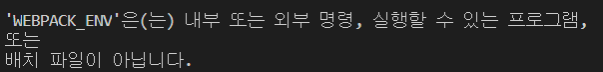

# Styles with Webpack part One

### 1. Fix the Error

- package.json의 `dev:assets`에 `WEBPACK_ENV=development` 추가 - mode를 설정해주기 위함

  ```
  "dev:assets": "WEBPACK_ENV=development webpack"
  ```

  그리고 `build:assets` 도 추가 - 코드를 server로 올려주는 기능

  `WEBPACK_ENV`를 `production`으로 설정

  ```
  "build:assets": "WEBPACK_ENV=production webpack",
  ```

- webpack.config.js

  MODE 변수를 생성해주고 config 안에 `mode: MODE` 추가

  ```js
  const MODE = process.env.WEBPACK_ENV;
  
  const config = {
  	mode: MODE,
  }
  ```

- 에러 발생

   

  - npm install cross-env

  - package.json

    ```json
    //"dev:assets": "WEBPACK_ENV=development webpack",
    "dev:assets": "cross-env WEBPACK_ENV=development webpack",
    ```

- CSS 관련 에러 발생: webpack이 css를 이해하지 못해서 발생

  webpack에게 rule을 따르도록 설정 - 확장자 scss인 파일을 만날 때마다 어떤 loader를 실행하도록

  [loader: webpack에게 파일을 처리하는 방법을 알려주는 역할]

  1. 파일 확장자가 scss인지 확인

     정규식을 사용해야 함

     ```
     test: /\.(scss)$/,
     ```

  2. 파일 확장자가 scss일 때, 어떤 것을 use 하도록 할 것임

     - 그 이전에 extract webpack text plugin 설치

       https://github.com/webpack-contrib/extract-text-webpack-plugin

       뒤에 조건을 붙여줄 것 - 새로운 버전을 사용하기 위해 @next를 넣어서 베타 버전 설치 진행

       ```
       npm install extract-text-webpack-plugin@next
       ```

     - package.json을 보면  ` "extract-text-webpack-plugin": "^4.0.0-beta.0",`와 같이 version 4에 beta가 붙어있는 것을 확인 가능

  3. 파일 확장자가 scss일 때, scss를 css로 변경 (in webpack.config.js)

     - scss 파일을 css 파일로 바꾸는 것이 선행되어야 함

     - 하지만 webpack은 loader를 사용할 때 끝에서부터 시작해서 처음으로 진행

       적힌대로라면 extraction을 먼저할 것 같지만, 사실은 아래에서 위로 진행하기 때문에, 반대 순서로 적어줘야 함

       즉 아래서부터 시작해 sass 파일을 다루고 -> scss와 css를 호환/번역해주는 postcss loader를 사용 -> css loader 사용

       ```js
       use: ExtractCss.extract([
                 {
                   loader: "css-loader",
                 },
                 {
                   loader: "postcss-loader",
                 },
                 {
                   loader: "sass-loader",
                 },
               ]),
       ```

  4. 전체 text 중 css의 text 추출

  5. 추출된 css를 분리된 하나의 파일로 생성