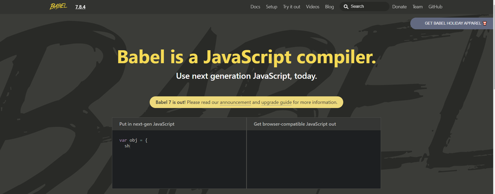

# ES6 on NodeJS using Babel

> 참고
>
> - 


### 1. Babel

https://babeljs.io/

- 최신의 Javascript 코드를 아주 무난한 예전의 Javascript 코드로 변환해줌

- POST

  서버로 정보를 제출하여 추가 또는 수정하기 위해 데이터를 전송하는 메소드
  
   

### 2. app.get

- index.js에 내용 추가

  app.get("/")에 접근하면 handleHome 함수를 수행

  결과를 확인해보면 무한 로딩에 빠진 것을 확인

  문제는 응답이 없어서 발생 (일반적인 홈페이지는 html로 응답)

  ```js
  //const express = require('express');
  //const app = express();
  
  //const PORT = 4000;
  
  //function handleListening(){
  //    console.log(`Listening on: http://localhost:${PORT}`);
  //}
  
  function handleHome(){
      console.log('HI from Home!!');
  }
  
  app.get("/", handleHome);
  
  //app.listen(PORT, handleListening);
  ```

- 응답 만들기

  handleHome과 같이 요청/응답을 처리하는 함수들은 2가지를 호출함

  1. request object: 우리가 정보를 얻고자 할 때 이용
  2. response object

  ```js
  function handleHome(req, res){
      res.send("Hello from home");
  }
  ```

  <서버 재 부팅 후 얻는 결과>

    

- index.js - 경로 "/profile"과 경로에 들어섰을 때 작동될 함수 handleProfile 생성

  ```js
  const express = require('express');
  const app = express();
  
  const PORT = 4000;
  
  function handleListening(){
      console.log(`Listening on: http://localhost:${PORT}`);
  }
  
  function handleHome(req, res){
      res.send("Hello from home");
  }
  
  function handleProfile(req, res){
      res.send("You are on my profile");
  }
  
  app.get("/", handleHome);
  
  app.get("/profile", handleProfile);
  
  app.listen(PORT, handleListening);
  ```

- 서버가 웹사이트 서버처럼 작동하기를 바란다면 위처럼 텍스트를 send하는 대신 완전한 html, css 파일을 send해 주어야 함