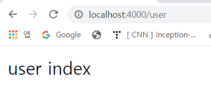
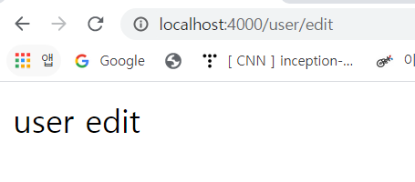

# Express Core: Routing

### 1. rename index.js

- index.js -> app.js

  ```js
  import express from "express";
  import morgan from "morgan";
  import helmet from "helmet";
  import cookieParser from "cookie-parser";
  import bodyParser from "body-parser";
  
  const app = express();
  
  const handleHome = (req, res) => res.send('Hello from my ass');
  
  const handleProfile = (req, res) => res.send("You are on my profile");
  
  app.use(cookieParser());
  app.use(bodyParser.json());
  app.use(bodyParser.urlencoded({extended: true}));
  app.use(helmet());
  app.use(morgan("dev"));
  
  app.get("/", handleHome);
  
  app.get("/profile", handleProfile);
  ```


### 2. Create init.js

- making init.js

  init.js에 application을 호출할 것임

- 먼저 app.js 수정 - 맨 마지막 라인에 아래와 같이 코드 추가

  ```js
  export default app;
  ```

  누군가 내 파일을 불러올 때(import) app object를 주겠다는 의미

  - app object

    ```js
    app.use(cookieParser());
    app.use(bodyParser.json());
    app.use(bodyParser.urlencoded({extended: true}));
    app.use(helmet());
    app.use(morgan("dev"));
    
    app.get("/", handleHome);
    
    app.get("/profile", handleProfile);
    ```

- init.js

  application을 app 파일에서 가져왔기 때문에 아래와 같이 가능

  **경로 설정 주의하기!**

  ```js
  import app from "./app";
  
  const PORT = 4000;
  
  const handleListening = () => console.log(`Listening on: http://localhost:${PORT}`);
  
  app.listen(PORT, handleListening);
  ```

- nodemon 수정 - package.json

  ```json
    "scripts": {
      "start": "nodemon --exec babel-node init.js --delay 2"
    },
  ```


### 2. Routes

router: route들의 복잡함을 쪼개주는데 사용할 수 있음

- router.js 만들기

  ```js
  import express from "express";
  
  export const userRouter = express.Router();
  
  userRouter.get("/", (req, res) => res.send("user index"))
  userRouter.get("/edit", (req, res) => res.send("user edit"))
  userRouter.get("/password", (req, res) => res.send("user password"))
  ```

  router는 많은 route들이 담긴 파일임

  그래서 app.js에서 `app.get("/", handleHome);`과 같이 하는 대신 Router를 갖다 쓸 것임

- app.js에 추가

  `use`: 누군가 `/user` 경로에 접속하면 `userRouter` 전체를 사용하겠다는 의미

  ```js
  app.use("/user", userRouter);
  ```

- localhost:4000/user에 접속한다면?

   

- localhost:4000/user/edit에 접속한다면?

   


### +) import 방법

- **default** export in app.js

  ```js
  //설정
  export default app;
  
  //사용
  import app from "./app";
  ```

- **NOT default** export in router.js

  ```js
  //설정
  export const userRouter = express.Router();
  
  //사용
import { userRouter } from "./router.js";
  ```
